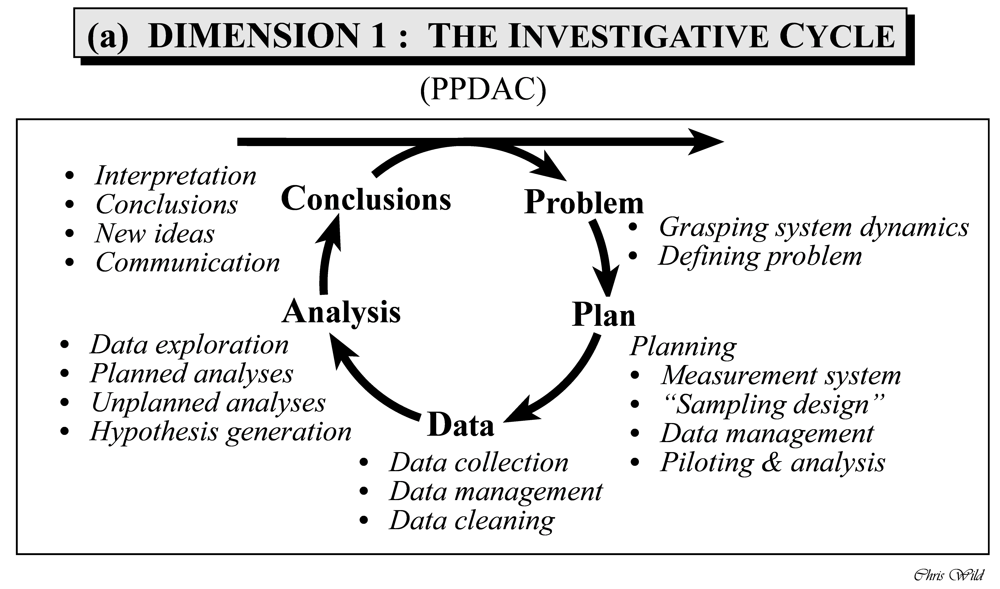

# Basics

{width="5%" fig-align="center"}

## Embarking


:::{#exr-einstieg}
### Hello stats

Present yourself to the group along the lines of the following three tags:

1. Your primary scientific *interest*
2. Your *expectations* to this course 
3. Your *background* in statistics and R

If you want, feel free to a *fun fact*. $\square$
:::


## Goals in statistics


### Taxonmy of goals

Many stories to be told. Here's one, on the goals pursued in statistics (and related fields), see Figure @fig-goals.


:::{.cell layout-align="center"}

:::{.cell-output-display}

:::{#fig-goals}

:::{}

<pre class="mermaid mermaid-js" data-label="fig-goals">flowchart LR
  A{Goals} --&gt; B(describe)
  A --&gt; C(predict)
  A --&gt; D(explain)
  B --&gt; E(distribution)
  B --&gt; F(assocation)
  B --&gt; G(extrapolation)
  C --&gt; H(point estimate)
  C --&gt; I(interval)
  D --&gt; J(causal inference)
  D --&gt; K(population)
  D --&gt; L(latent construct)

</pre>
:::


A taxonomy of statistical goals
:::
:::
:::


::: callout-note
Note that "goals" do not exist in the world. We make them up in our heads. Hence, they have no ontological existence, they are epistemological beasts. This entails that we are free to devise goals as we wish, provided we can convince ourselves and other souls of the utility of our creativity.
:::

@hernan_second_2019 distinguish:


-   *Description*: "How can women aged 60--80 years with stroke history be partitioned in classes defined by their characteristics?"

-   *Prediction*: "What is the probability of having a stroke next year for women with certain characteristics?"

-   *Causal inference*: "Will starting a statin reduce, on average, the risk of stroke in women with certain characteristics?"


### Lab: Your goals


Match *your* (most pressing) research goal to the nomenclature for scientific goals as shown in @fig-goals.
Explain your reasoning.

Next, put three research themes or studies you particularly like to this nomenclature and explain your reasoning.


## A framework for problem solving

### PPDAC

The PPDAC Model is a methodological framework (aka a model) for applying the scientific method to any analytical or research question, or at least it is applicable to quite a few [@mackay_scientific_2000].
It is not meant to be a rigid sequence, but rather a cycle that may turn a number of rounds like a spiral.
Statistician Chris Wild puts the PPDAC cycle in the following figure, see Figure @fig-ppdac. In [this short essay](https://www.stat.auckland.ac.nz/~wild/d2i/articles/1.4%20Place%20of%20data%20analysis%20in%20problem%20solving_ARTICLE.pdf), he summaries his ideas on how to use the PPDAC as a tool for data analysis in problem solving.

{#fig-ppdac}


Wickham and Grolemund (see Figure @fig-data-journey in @sec-data-journey) provide a suggestion of the parts of the statistical analyses, that is the "Analysis" step in the PPDAC.


### Fundamental issues in data analysis


@wild_statistical_1999  further note that variation is one of the essential characteristics of data. They discern to types of variation however, see Figure @fig-variation.

{#fig-variation}

@wild_statistical_1999 give a more systematic overview on how a quantitative research question - applied or basic - can be tackled and conceived.
For example, in their paper the authors enumarate some dispositions that researcher should embrace in order to fruitfully engage in empirical research:

- Scepticism
- Imagination
- Curiosity
- Opennness
- A propensity to seek deeper menaing
- Being logical
- Engagement
- Perseverance


## Getting started

### R Basics

Check out the course [Statistics1, chapter on importing data](https://statistik1.netlify.app/020-r#daten-importieren) for an accessible introduction to getting started with R and RStudio.

Please also note that R and RStudio should be installed before starting (this course).

In addition, your R packages should be updtodate, according to Arnold Schwarzenegger (s. @fig-arnie).

{#fig-arnie width="50%"}


### Help me, I'm lost

Check-out this [introductory statistics course](https://statistik1.netlify.app/).

Pro-Tipp: Use the translation tool of your browswer to translate into your favorite language.


### Initial quiz


To get an idea whether you have digested some R basics, consider [this quiz](https://datenwerk.netlify.app/posts/r-quiz/r-quiz).


<!-- :::{#exr-q1} -->

<!-- ## Define a variable -->

<!-- Define in R the variable `age` and assign the value `42`.^[`age <- 42`, spaces are optional but useful] -->
<!-- ::: -->


<!-- :::{#exr-q2} -->

<!-- ## Define a variable as a string -->

<!-- Define in R the variable `name` and assign the value `me`.^[`name <- "me"`] -->
<!-- ::: -->


<!-- :::{#exr-q3} -->

<!-- ## Define a variable by another variable -->

<!-- Define in R the variable `name` and assign the *variable* `age`.^[`name <- age`] -->
<!-- ::: -->


<!-- :::{#exr-q3a} -->

<!-- ## Call a function -->

<!-- Ask R what today's  `date()` is, that is, call a function.^[`date()`] -->
<!-- ::: -->


<!-- :::{#exr-q4} -->

<!-- ## Define a vector -->

<!-- Define in R a vector `x` with the values 1,2,3 .^[`x <- c(1, 2, 3)`] -->
<!-- ::: -->


<!-- :::{#exr-q5} -->

<!-- ## Vector wise computation -->

<!-- Square each value in the vector `x`.^[`x^2`] -->
<!-- ::: -->


<!-- :::{#exr-q6} -->

<!-- ## Vector wise computation 2 -->

<!-- Square each value in the vector `x` and sum up the values.^[`sum(x^2)`] -->
<!-- ::: -->


<!-- :::{#exr-q7} -->

<!-- ## Vector wise computation 3 -->

<!-- Square each value in the vector `x`, sum up the values, and divide by 3.^[`mean(x^2)`] -->
<!-- ::: -->

<!-- :::{#exr-q8} -->

<!-- ## Compute the variance -->

<!-- Compute the variance of `x` using basic arithmetic.^[`sum(x^2)`][^sol8] -->
<!-- ::: -->


<!-- [^sol8]: -->


<!--     ```{r} -->
<!--     x <- c(1, 2, 3) -->

<!--     sum((x - mean(x))^2) / (length(x)-1) -->

<!--     # compare:  -->
<!--     var(x)   -->
<!--     ``` -->


<!-- :::{#exr-q9} -->

<!-- ## Work with NA -->

<!-- Define the vector `y` with the values 1,2,NA. Compute the mean. Explain the results.^[`y <- c(1, 2, NA); mean(y)` NA (not available, ie., missing) is contagious in R: If there's a missing element, R will assume that something has gone wrong and will raise a red flag, i.e, give you a NA back.] -->
<!-- ::: -->


## Data import


Check out [chapter 3 in Statistics1](https://statistik1.netlify.app/020-r#daten-importieren) on how to import data into RStudio and for some basic concepts about "tidy data".

Spoiler: There's a button in RStudio in the "Environment" Pane saying "Import Dataset". 
Just click it, and things should work out.


:::{.callout-note}
I strongly advice working with *Projects* in RStudio, as it makes working with file paths a lot easier.
:::


## Blitz start with data {#sec-blitz-data}

We'll work predominantly with the following data sets.


### Motor Trends Cars

To blitz start with data, type the following in R:


::: {.cell layout-align="center"}

```{.r .cell-code}
data(mtcars)
```
:::


And the data set `mtcars` will be available.

To get help for the data set, type `help(mtcars)`





### Penguins


A bit more advanced, but it's a nice data set, try the Palmer Penguins data set:


::: {.cell layout-align="center"}

```{.r .cell-code}
d <- read.csv("https://vincentarelbundock.github.io/Rdatasets/csv/palmerpenguins/penguins.csv")

head(d)  # see the first few rows, the "head" of the table
```

::: {.cell-output-display}
<div class="kable-table">

| rownames|species |island    | bill_length_mm| bill_depth_mm| flipper_length_mm| body_mass_g|sex    | year|
|--------:|:-------|:---------|--------------:|-------------:|-----------------:|-----------:|:------|----:|
|        1|Adelie  |Torgersen |           39.1|          18.7|               181|        3750|male   | 2007|
|        2|Adelie  |Torgersen |           39.5|          17.4|               186|        3800|female | 2007|
|        3|Adelie  |Torgersen |           40.3|          18.0|               195|        3250|female | 2007|
|        4|Adelie  |Torgersen |             NA|            NA|                NA|          NA|       | 2007|
|        5|Adelie  |Torgersen |           36.7|          19.3|               193|        3450|female | 2007|
|        6|Adelie  |Torgersen |           39.3|          20.6|               190|        3650|male   | 2007|

</div>
:::
:::


Here's some [documentation (code book)](https://vincentarelbundock.github.io/Rdatasets/doc/palmerpenguins/penguins.html) for this data set.





## Lab

Import *your* research data into R.

>   🧑‍🎓 I want more exercises on R!

>   👨‍🏫 Checkout all [exercises tagged with "R"](https://datenwerk.netlify.app/#category=R) on [datenwerk](https://datenwerk.netlify.app/). Pro-Tipp: Use the translation function of your browers to translate the webpage into your favorite language.


## More data sets 


Check out [this curated list](https://data-se.netlify.app/2022/02/23/data-sets-for-for-teaching/) of data sets useful for learning and practicing your data skills.


## If nothing else helps

Stay calm and behold the [infinity](https://upload.wikimedia.org/wikipedia/commons/thumb/6/69/Spiral_of_black_and_white_squares_10_till_repetition_spiraling_in.gif/600px-Spiral_of_black_and_white_squares_10_till_repetition_spiraling_in.gif?20170912223608).


## Going further


Similar to the "goals" of statistics as presented here, @gelman_regression_2021, chap. 1.1 proposes three "challenges" of statistical inference.

@wild_statistical_1999 discuss the thought processes involved in statistical problem solving seen from a broad perspective.
@ismay_statistical_2020 is a helpful start into the first steps in R.


If you want to dig deeper, check-out this [course on statistical inference using Bayes statistics](https://start-bayes.netlify.app/).
If you are interested in predictive modeling, check-out [this couse](https://ds1-prognosemodellierung.netlify.app/).


