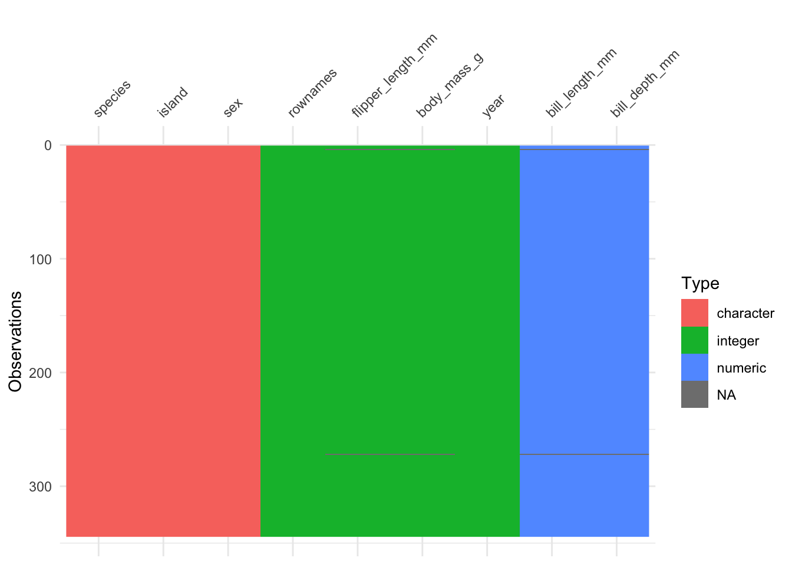
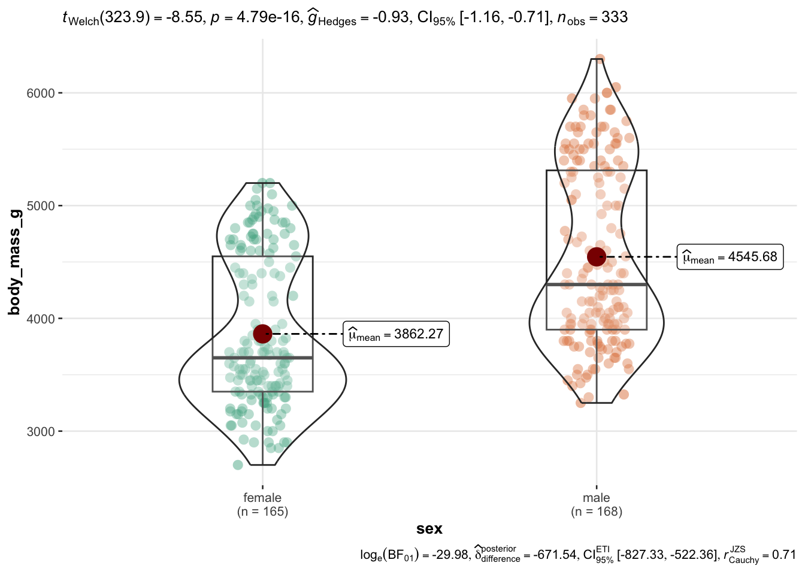

# Exploratory Data Analysis

{width="5%"}


## R packages needed for this chapter

Make sure to run the following code chunks in order to start the neccessary R packages.


::: {.cell layout-align="center"}

```{.r .cell-code}
library(easystats)  # make stats easy again
library(tidyverse)  # data wrangling
library(tableone)  # tables, optional
library(rio)  # import/export data, eg., to excel
library(ggpubr)  # simple data visualization
library(ggstatsplot)  # data visualization ornamented with statistics
```
:::


:::{.callout-caution}
You can only start a package if you have it installed upfront.
:::

Check out the course [Statistics1, chapter on introducing R](https://statistik1.netlify.app/020-r#r-pakete) for an accessible introduction to getting started with R and RStudio and on how to *install R packages*.


## What's EDA?


Exploratory Data Analysis (EDA) is a procedure to scrutinize a dataset at hand in order learn about it. EDA comprises descriptive statistics, data visualization and data transformation techniques (such as dimension reduction).

It's not so mathematical deep as modelling, but in practice it's really important.

There's this famous saying:

> In Data Science, 80% of time spent prepare data, 20% of time spent complain about the need to prepare data.

EDA can roughly be said to comprise the following parts:

-   Importing (and exporting) data
-   Data cleansing (such as deal with missing data etc)
-   Data transformation or "wrangling" (such as long to wide format)
-   Computing desriptive statistics (such as the notorious mean)
-   Analyzing distributions (is it normal?)
-   Finding patterns in data (aka data mining)
-   More complex data transformation techniques (such as factor analysis)


## Data journey {#sec-data-journey}

@r4ds present a visual sketch of what could be called the "data journey",
i.e., the steps we are taking in order to learn from data, seen from an hands-on angle,
see @fig-data-journey.

{#fig-data-journey}


## Blitz data


See @sec-blitz-data for some data sets suitable to get going.


## Data cleansing

The R package {janitor} provides some nice stuff for data cleansing. Check out [this case study](https://www.exploringdata.org/post/how-to-clean-data-janitor-package/).


## Convenience functions

There a quite a few functions (residing in some packages) that help you doing EDA from a helicoptor point of view. In other words, you do not have to pay attention to nitty-gritty details, the function will do that for you. 
This is approach is, well, convenient, but of course comes at a price.
You will not have a great amount of choice and influence on the way the data is analyzed and presented. 

We'll use the penguins data set for a demonstration.


::: {.cell layout-align="center"}

```{.r .cell-code}
penguins <- read.csv("https://vincentarelbundock.github.io/Rdatasets/csv/palmerpenguins/penguins.csv")
```
:::


### Data Explorer

There are many systems and approaches to explore data. One particular interesting system is the R-package `DataExplorer`.

{width="20%"}

Check it out [on its Githup page](http://boxuancui.github.io/DataExplorer/).


::: {.cell layout-align="center"}

```{.r .cell-code}
library(DataExplorer)
```
:::


For example, we can easily get an overview of the distribution of all (quantitative) variables in the data set.
What do you notice on inspecting the distributions, see @fig-peng-distros?


::: {.cell layout-align="center"}

```{.r .cell-code}
plot_histogram(penguins)
```

::: {.cell-output-display}
{#fig-peng-distros fig-align='center' width=70%}
:::
:::


A quick "introduction" to the data set is provided by the function `plot_intro`, see @fig-peng-intro.


::: {.cell layout-align="center"}

```{.r .cell-code}
plot_intro(penguins)
```

::: {.cell-output-display}
{#fig-peng-intro fig-align='center' width=70%}
:::
:::


We can also get a glimpse on all the qualitative data columns in our datra set, see @fig-peng-bars.


::: {.cell layout-align="center"}

```{.r .cell-code}
plot_bar(penguins)
```

::: {.cell-output-display}
{#fig-peng-bars fig-align='center' width=70%}
:::
:::


### visdat

The r package `visdat` provides a "fingerprint" of a data set.

Let's show-case it using the penguins data set.


::: {.cell layout-align="center"}

```{.r .cell-code}
library(visdat)  # must be installed
vis_dat(penguins)
```

::: {.cell-output-display}
{fig-align='center' width=70%}
:::
:::


### vtree

A bit similar to {DataExplorer}, the [R package {vtree}](https://nbarrowman.github.io/vtree) helps to explore visually datasets, see @fig-vtree1.


::: {.cell layout-align="center"}

```{.r .cell-code}
library(vtree)
vtree(penguins, c("sex", "island"))
```

::: {.cell-output-display}
{#fig-vtree1 fig-align='center' width=50%}
:::
:::


### The easystats way

There are some packages, such as `{easystats}`, which provide comfortable access to basic statistics:


::: {.cell layout-align="center"}

```{.r .cell-code}
library(easystats)  # once per session
describe_distribution(penguins)
```

::: {.cell-output-display}
<div class="kable-table">

|Variable          |       Mean|          SD|      IQR|    Min|    Max|   Skewness|   Kurtosis|   n| n_Missing|
|:-----------------|----------:|-----------:|--------:|------:|------:|----------:|----------:|---:|---------:|
|rownames          |  172.50000|  99.4484791|  172.500|    1.0|  344.0|  0.0000000| -1.2000000| 344|         0|
|bill_length_mm    |   43.92193|   5.4595837|    9.300|   32.1|   59.6|  0.0531181| -0.8760270| 342|         2|
|bill_depth_mm     |   17.15117|   1.9747932|    3.125|   13.1|   21.5| -0.1434646| -0.9068661| 342|         2|
|flipper_length_mm |  200.91520|  14.0617137|   23.250|  172.0|  231.0|  0.3456818| -0.9842729| 342|         2|
|body_mass_g       | 4201.75439| 801.9545357| 1206.250| 2700.0| 6300.0|  0.4703293| -0.7192219| 342|         2|
|year              | 2008.02907|   0.8183559|    2.000| 2007.0| 2009.0| -0.0537278| -1.5049366| 344|         0|

</div>
:::
:::


`describe_distribution` provides us with an overview on typical descriptive summaries.

How to export to MS Office? Well, one simple approach is obviously to copy-paste. 
Checkout @sec-office for more advanced options.


For nominal variables, consider `data_tabulate`:


::: {.cell layout-align="center"}

```{.r .cell-code}
data_tabulate(penguins, select = c("sex", "island")) |> 
  print_md() 
```

::: {.cell-output-display}


Table: Frequency Table

|Variable |     Value|   N| Raw %| Valid %| Cumulative %|
|:--------|---------:|---:|-----:|-------:|------------:|
|sex      |      (NA)|  11|  3.20|    3.20|         3.20|
|         |    female| 165| 47.97|   47.97|        51.16|
|         |      male| 168| 48.84|   48.84|       100.00|
|         |      (NA)|   0|  0.00|    (NA)|         (NA)|
|         |          |    |      |        |             |
|island   |    Biscoe| 168| 48.84|   48.84|        48.84|
|         |     Dream| 124| 36.05|   36.05|        84.88|
|         | Torgersen|  52| 15.12|   15.12|       100.00|
|         |      (NA)|   0|  0.00|    (NA)|         (NA)|
|         |          |    |      |        |             |


:::
:::


Note that `print_md` helps to get a more visually pleasing (HTML) output, and not only raw command line style output.

We can also get *grouped* tabulations,
which amounts to something similar to a [contingency table](https://en.wikipedia.org/wiki/Contingency_table):


::: {.cell layout-align="center"}

```{.r .cell-code}
penguins %>% 
  group_by(sex) %>% 
  data_tabulate(select = "island", collapse = TRUE)
```

::: {.cell-output .cell-output-stdout}

```
# Frequency Table

Variable |        Group |     Value |  N | Raw % | Valid % | Cumulative %
---------+--------------+-----------+----+-------+---------+-------------
island   |       sex () |    Biscoe |  5 | 45.45 |   45.45 |        45.45
         |              |     Dream |  1 |  9.09 |    9.09 |        54.55
         |              | Torgersen |  5 | 45.45 |   45.45 |       100.00
         |              |      <NA> |  0 |  0.00 |    <NA> |         <NA>
---------+--------------+-----------+----+-------+---------+-------------
island   | sex (female) |    Biscoe | 80 | 48.48 |   48.48 |        48.48
         |              |     Dream | 61 | 36.97 |   36.97 |        85.45
         |              | Torgersen | 24 | 14.55 |   14.55 |       100.00
         |              |      <NA> |  0 |  0.00 |    <NA> |         <NA>
---------+--------------+-----------+----+-------+---------+-------------
island   |   sex (male) |    Biscoe | 83 | 49.40 |   49.40 |        49.40
         |              |     Dream | 62 | 36.90 |   36.90 |        86.31
         |              | Torgersen | 23 | 13.69 |   13.69 |       100.00
         |              |      <NA> |  0 |  0.00 |    <NA> |         <NA>
-------------------------------------------------------------------------
```


:::
:::


:::{callout-note}
Checkout the function reference of your favorite package in order to learn what's on the shelf.
For example, [here's the function reference site](https://easystats.github.io/datawizard/reference/index.html) of `datawizard`, one of the packages in the `easystats` ecosystem.
::::


### TableOne

The [R package `{tableOne}`](https://cran.r-project.org/web/packages/tableone/vignettes/introduction.html) provides something like the typical "Table 1" in many papers.


From the homepage:

>   The tableone package is an R package that eases the construction of “Table 1”, i.e., patient baseline characteristics table commonly found in biomedical research papers. The packages can summarize both continuous and categorical variables mixed within one table. Categorical variables can be summarized as counts and/or percentages. Continuous variables can be summarized in the “normal” way (means and standard deviations) or “nonnormal” way (medians and interquartile ranges).


::: {.cell layout-align="center"}

```{.r .cell-code}
penguins <- read.csv("https://vincentarelbundock.github.io/Rdatasets/csv/palmerpenguins/penguins.csv")
```
:::


It's quite simple to use:


::: {.cell layout-align="center"}

```{.r .cell-code}
library(tableone)
CreateTableOne(data = penguins)
```

::: {.cell-output .cell-output-stdout}

```
                               
                                Overall         
  n                                 344         
  rownames (mean (SD))           172.50 (99.45) 
  species (%)                                   
     Adelie                         152 (44.2)  
     Chinstrap                       68 (19.8)  
     Gentoo                         124 (36.0)  
  island (%)                                    
     Biscoe                         168 (48.8)  
     Dream                          124 (36.0)  
     Torgersen                       52 (15.1)  
  bill_length_mm (mean (SD))      43.92 (5.46)  
  bill_depth_mm (mean (SD))       17.15 (1.97)  
  flipper_length_mm (mean (SD))  200.92 (14.06) 
  body_mass_g (mean (SD))       4201.75 (801.95)
  sex (%)                                       
                                     11 ( 3.2)  
     female                         165 (48.0)  
     male                           168 (48.8)  
  year (mean (SD))              2008.03 (0.82)  
```


:::
:::


To get more detailled results, use the `summary` method:


::: {.cell layout-align="center"}

```{.r .cell-code}
tab1 <- CreateTableOne(data = penguins)
summary(tab1)
```

::: {.cell-output .cell-output-stdout}

```

     ### Summary of continuous variables ###

strata: Overall
                    n miss p.miss mean    sd median  p25  p75  min  max  skew
rownames          344    0    0.0  172  99.4    172   87  258    1  344  0.00
bill_length_mm    344    2    0.6   44   5.5     44   39   48   32   60  0.05
bill_depth_mm     344    2    0.6   17   2.0     17   16   19   13   22 -0.14
flipper_length_mm 344    2    0.6  201  14.1    197  190  213  172  231  0.35
body_mass_g       344    2    0.6 4202 802.0   4050 3550 4750 2700 6300  0.47
year              344    0    0.0 2008   0.8   2008 2007 2009 2007 2009 -0.05
                  kurt
rownames          -1.2
bill_length_mm    -0.9
bill_depth_mm     -0.9
flipper_length_mm -1.0
body_mass_g       -0.7
year              -1.5

=======================================================================================

     ### Summary of categorical variables ### 

strata: Overall
     var   n miss p.miss     level freq percent cum.percent
 species 344    0    0.0    Adelie  152    44.2        44.2
                         Chinstrap   68    19.8        64.0
                            Gentoo  124    36.0       100.0
                                                           
  island 344    0    0.0    Biscoe  168    48.8        48.8
                             Dream  124    36.0        84.9
                         Torgersen   52    15.1       100.0
                                                           
     sex 344    0    0.0             11     3.2         3.2
                            female  165    48.0        51.2
                              male  168    48.8       100.0
                                                           
```


:::
:::


How to export to MS Office? Well, one simple approach is obviously to copy-paste. 
Checkout @sec-office for more advanced options.


## Lab

Take your research data and prepare it using (at least) one of the "convenience" functions for data cleansing presented above. 


## Tidyverse

### Intro to the tidyverse

The Tidyverse is probably the R thing with the most publicity. And it's great. It's a philosophy baken into an array of R packages. Perhaps central is the idea that a lot of little lego pieces, if fitting nicely together, provides a simple yet flexibel and thus powerful machinery.

There's a lot of introctory material to the tidyverse around [for instance ](https://datasciencebook.ca/wrangling.html), so I'm not repeating that here.


### More advanced tidyverse


#### Repeat a function over many columns

At times, we would like to compute the same functions for many variables, ie columns for tidyverse applications.

Let's load the penguins data for illustration.


::: {.cell layout-align="center"}

```{.r .cell-code}
penguins <- read_csv("https://vincentarelbundock.github.io/Rdatasets/csv/palmerpenguins/penguins.csv")

head(penguins)
```

::: {.cell-output-display}
<div class="kable-table">

| rownames|species |island    | bill_length_mm| bill_depth_mm| flipper_length_mm| body_mass_g|sex    | year|
|--------:|:-------|:---------|--------------:|-------------:|-----------------:|-----------:|:------|----:|
|        1|Adelie  |Torgersen |           39.1|          18.7|               181|        3750|male   | 2007|
|        2|Adelie  |Torgersen |           39.5|          17.4|               186|        3800|female | 2007|
|        3|Adelie  |Torgersen |           40.3|          18.0|               195|        3250|female | 2007|
|        4|Adelie  |Torgersen |             NA|            NA|                NA|          NA|NA     | 2007|
|        5|Adelie  |Torgersen |           36.7|          19.3|               193|        3450|female | 2007|
|        6|Adelie  |Torgersen |           39.3|          20.6|               190|        3650|male   | 2007|

</div>
:::
:::


Say, we would like to compute the mean value for each numeric variable in the data set:


::: {.cell layout-align="center"}

```{.r .cell-code}
penguins %>% 
  summarise(across(bill_length_mm:body_mass_g, mean, na.rm = TRUE))
```

::: {.cell-output-display}
<div class="kable-table">

| bill_length_mm| bill_depth_mm| flipper_length_mm| body_mass_g|
|--------------:|-------------:|-----------------:|-----------:|
|       43.92193|      17.15117|          200.9152|    4201.754|

</div>
:::
:::


Synonymously, we could write:


::: {.cell layout-align="center"}

```{.r .cell-code}
penguins %>% 
  summarise(across(where(is.numeric), ~ mean(.x, na.rm = TRUE)))
```

::: {.cell-output-display}
<div class="kable-table">

| rownames| bill_length_mm| bill_depth_mm| flipper_length_mm| body_mass_g|     year|
|--------:|--------------:|-------------:|-----------------:|-----------:|--------:|
|    172.5|       43.92193|      17.15117|          200.9152|    4201.754| 2008.029|

</div>
:::
:::


Say, we would like to compute the z-value of each numeric variable.

Addmittedly, `easystats` makes it quite simple:


::: {.cell layout-align="center"}

```{.r .cell-code}
penguins %>% 
  standardise(select = is.numeric) %>% 
  head()
```

::: {.cell-output-display}
<div class="kable-table">

|  rownames|species |island    | bill_length_mm| bill_depth_mm| flipper_length_mm| body_mass_g|sex    |      year|
|---------:|:-------|:---------|--------------:|-------------:|-----------------:|-----------:|:------|---------:|
| -1.724511|Adelie  |Torgersen |     -0.8832047|     0.7843001|        -1.4162715|  -0.5633167|male   | -1.257484|
| -1.714456|Adelie  |Torgersen |     -0.8099390|     0.1260033|        -1.0606961|  -0.5009690|female | -1.257484|
| -1.704400|Adelie  |Torgersen |     -0.6634077|     0.4298326|        -0.4206603|  -1.1867934|female | -1.257484|
| -1.694345|Adelie  |Torgersen |             NA|            NA|                NA|          NA|NA     | -1.257484|
| -1.684289|Adelie  |Torgersen |     -1.3227986|     1.0881294|        -0.5628905|  -0.9374027|female | -1.257484|
| -1.674234|Adelie  |Torgersen |     -0.8465718|     1.7464261|        -0.7762357|  -0.6880121|male   | -1.257484|

</div>
:::
:::


See the help page of `standardise` for mor details on how to select variables and on more options.


But for the purpose of illustration, let's do it with more simple means, i.e. tidyverse only.


::: {.cell layout-align="center"}

```{.r .cell-code}
penguins %>% 
  transmute(across(bill_length_mm:body_mass_g, 
                .fns = ~ {(.x - mean(.x, na.rm = TRUE)) / sd(.x, na.rm = TRUE)},
                .names = "{.col}_z")) %>% 
  head()
```

::: {.cell-output-display}
<div class="kable-table">

| bill_length_mm_z| bill_depth_mm_z| flipper_length_mm_z| body_mass_g_z|
|----------------:|---------------:|-------------------:|-------------:|
|       -0.8832047|       0.7843001|          -1.4162715|    -0.5633167|
|       -0.8099390|       0.1260033|          -1.0606961|    -0.5009690|
|       -0.6634077|       0.4298326|          -0.4206603|    -1.1867934|
|               NA|              NA|                  NA|            NA|
|       -1.3227986|       1.0881294|          -0.5628905|    -0.9374027|
|       -0.8465718|       1.7464261|          -0.7762357|    -0.6880121|

</div>
:::
:::


It's maybe more succint to put the z-value computation in its function, and then just apply this function:


::: {.cell layout-align="center"}

```{.r .cell-code}
z_stand <- function(x){
  (x - mean(x, na.rm = TRUE)) / sd(x, na.rm = TRUE)
}
```
:::

::: {.cell layout-align="center"}

```{.r .cell-code}
d2 <-
penguins %>% 
  mutate(across(bill_length_mm:body_mass_g, 
                .fns = z_stand))
  
d2 %>% 
  glimpse()
```

::: {.cell-output .cell-output-stdout}

```
Rows: 344
Columns: 9
$ rownames          <dbl> 1, 2, 3, 4, 5, 6, 7, 8, 9, 10, 11, 12, 13, 14, 15, 1…
$ species           <chr> "Adelie", "Adelie", "Adelie", "Adelie", "Adelie", "A…
$ island            <chr> "Torgersen", "Torgersen", "Torgersen", "Torgersen", …
$ bill_length_mm    <dbl> -0.8832047, -0.8099390, -0.6634077, NA, -1.3227986, …
$ bill_depth_mm     <dbl> 0.78430007, 0.12600328, 0.42983257, NA, 1.08812936, …
$ flipper_length_mm <dbl> -1.4162715, -1.0606961, -0.4206603, NA, -0.5628905, …
$ body_mass_g       <dbl> -0.563316704, -0.500969030, -1.186793445, NA, -0.937…
$ sex               <chr> "male", "female", "female", NA, "female", "male", "f…
$ year              <dbl> 2007, 2007, 2007, 2007, 2007, 2007, 2007, 2007, 2007…
```


:::
:::


#### Rowwise operations


For technical reasons, it's a bit cumbersome in (base) R to compute rowwise operations. 
The thing is, R's dataframes are organized as vectors of *columns* so it's much easier to do stuff columnwise.

However, since recently, computing rowwise operations with the tidyverse has become simpler.
Consider the following example. Say we would like to know the highest z-value for each variable we just computed, that is the highest values *per individual*, ie., by row in the data frame.


::: {.cell layout-align="center"}

```{.r .cell-code}
d2 %>% 
  drop_na() %>% 
  rowwise() %>% 
  mutate(max_z = max(c(bill_length_mm, bill_depth_mm, flipper_length_mm, body_mass_g))) %>% 
  head()
```

::: {.cell-output-display}
<div class="kable-table">

| rownames|species |island    | bill_length_mm| bill_depth_mm| flipper_length_mm| body_mass_g|sex    | year|     max_z|
|--------:|:-------|:---------|--------------:|-------------:|-----------------:|-----------:|:------|----:|---------:|
|        1|Adelie  |Torgersen |     -0.8832047|     0.7843001|        -1.4162715|  -0.5633167|male   | 2007| 0.7843001|
|        2|Adelie  |Torgersen |     -0.8099390|     0.1260033|        -1.0606961|  -0.5009690|female | 2007| 0.1260033|
|        3|Adelie  |Torgersen |     -0.6634077|     0.4298326|        -0.4206603|  -1.1867934|female | 2007| 0.4298326|
|        5|Adelie  |Torgersen |     -1.3227986|     1.0881294|        -0.5628905|  -0.9374027|female | 2007| 1.0881294|
|        6|Adelie  |Torgersen |     -0.8465718|     1.7464261|        -0.7762357|  -0.6880121|male   | 2007| 1.7464261|
|        7|Adelie  |Torgersen |     -0.9198375|     0.3285561|        -1.4162715|  -0.7191859|female | 2007| 0.3285561|

</div>
:::
:::


## Data visualization


Visualize your data -- plots can provide insights which can't (easily) delivered by numbers alone. See [Anscombe's Quartet](https://public.tableau.com/app/profile/dan.murray/viz/AnscombesQuartet_16/AnscombesQuartet).


The star on the R visualization sky is called [ggplot](https://ggplot2.tidyverse.org/).
It probably is one of the most advanced statistical visualization package on the planet.


However, for a quick start,
there are some nice wrappers on ggplot,
levering the beauty of ggplot but making the making simple(r).


### ggpubr

[ggpubr](https://rpkgs.datanovia.com/ggpubr/index.html) is a simple yet powerful way to visualize data.


::: {.cell layout-align="center"}

```{.r .cell-code}
library(ggpubr)  # must be installed
```
:::


Let's visualize the association of bill length (see @fig-bill-length) with body mass, see @fig-peng-scatter1.

{#fig-bill-length width=50%}


::: {.cell layout-align="center"}

```{.r .cell-code}
ggscatter(penguins,
          x = "bill_length_mm",
          y = "body_mass_g",
          color = "sex")
```

::: {.cell-output-display}
{#fig-peng-scatter1 fig-align='center' width=70%}
:::
:::


Let's improve a bit on the plot, see @fig-peng-scatter2.


::: {.cell layout-align="center"}

```{.r .cell-code}
ggscatter(penguins,
          x = "bill_length_mm",
          y = "body_mass_g",
          color = "species",
          shape = "species",
          add = "reg.line",
          xlab = "Bill length (mm)",
          ylab = "Body maxx (g)",
          conf.int = TRUE,
          ellipse = TRUE,
          cor.coef = TRUE)
```

::: {.cell-output-display}
{#fig-peng-scatter2 fig-align='center' width=70%}
:::
:::


Check out the [manual](https://rpkgs.datanovia.com/ggpubr/reference/ggscatter.html) of the function for further notice on the options.

### ggstatsplot

In addtion, consider [ggstatsplot])(https://indrajeetpatil.github.io/ggstatsplot/). 
Let's use the `mtcars` dataset for a quick demonstration.
For example, assume you would like to compare two group of cars, automatic vs. manual shifting, in terms of fuel economy.
Here we go, @fig-ggstatsplot1.


::: {.cell layout-align="center"}

```{.r .cell-code}
library(ggstatsplot)
ggbetweenstats(
  data = penguins,
  x = sex,
  y = body_mass_g)
```

::: {.cell-output-display}
{#fig-ggstatsplot1 fig-align='center' width=70%}
:::
:::


Checkout the [manual](https://indrajeetpatil.github.io/ggstatsplot/reference/ggbetweenstats.html) of the function to get a handle on all the options and details.

Wait, let's drop all missing values (`NA`) before we plot using `drop_na()`, @fig-ggstatsplot2.


::: {.cell layout-align="center"}

```{.r .cell-code}
penguins_no_na <-
penguins |> 
  drop_na()  # from package "tidyverse"

ggbetweenstats(
  data = penguins_no_na,
  x = sex,
  y = body_mass_g)
```

::: {.cell-output-display}
{#fig-ggstatsplot2 fig-align='center' width=70%}
:::
:::


## Exporting to Office {#sec-office}

### Word

#### Basic approach

It's no big deal to get it into Word processors as well.
Here's one simple way:

1. Open a Quarto-Document in RStudio
2. produce some nice table
4. copy and paste it to Word


Here's an example of producing a nice table:


::: {.cell layout-align="center"}

```{.r .cell-code}
library(easystats)  # once per session only
describe_distribution(penguins) |> print_md()
```

::: {.cell-output-display}


|Variable          |    Mean |     SD |     IQR |              Range | Skewness | Kurtosis |   n | n_Missing |
|:-----------------|:-------:|:------:|:-------:|:------------------:|:--------:|:--------:|:---:|:---------:|
|rownames          |  172.50 |  99.45 |  172.50 |     (1.00, 344.00) |     0.00 |    -1.20 | 344 |         0 |
|bill_length_mm    |   43.92 |   5.46 |    9.30 |     (32.10, 59.60) |     0.05 |    -0.88 | 342 |         2 |
|bill_depth_mm     |   17.15 |   1.97 |    3.12 |     (13.10, 21.50) |    -0.14 |    -0.91 | 342 |         2 |
|flipper_length_mm |  200.92 |  14.06 |   23.25 |   (172.00, 231.00) |     0.35 |    -0.98 | 342 |         2 |
|body_mass_g       | 4201.75 | 801.95 | 1206.25 | (2700.00, 6300.00) |     0.47 |    -0.72 | 342 |         2 |
|year              | 2008.03 |   0.82 |    2.00 | (2007.00, 2009.00) |    -0.05 |    -1.50 | 344 |         0 |


:::
:::


Note that `print_md()` will "prettify" your output. Without this line, your output will look more command-line-nerdy style.


#### Additional ways

In addition, one [user gave the following recommendation on StackOverflow](https://stackoverflow.com/questions/60815583/how-to-save-table1-package-output-table-to-doc-format-r):


>   Another possible solution: The above strategy did not work for me when I had a similar issue, but it was resolved once I knitted the table1 object and opened the html in browser to copy the html table and successfully paste into word. Doing it within RStudio viewer would not work for me for some reason.


Lastly, there are options to export directly to Word or Powerpoint.
The R package `{flextable}` provides functions for that purpose, see @tbl-flex^[Don't forget to install it before you use it.]:


::: {#tbl-flex .cell layout-align="center" tbl-cap='A table using the R package flextable'}

```{.r .cell-code}
library(flextable)
my_flex_tab <- flextable(head(penguins))
my_flex_tab
```

::: {.cell-output-display}


```{=html}
<div class="tabwid"><style>.cl-28325ac6{}.cl-28273132{font-family:'Helvetica';font-size:11pt;font-weight:normal;font-style:normal;text-decoration:none;color:rgba(0, 0, 0, 1.00);background-color:transparent;}.cl-282d19d0{margin:0;text-align:right;border-bottom: 0 solid rgba(0, 0, 0, 1.00);border-top: 0 solid rgba(0, 0, 0, 1.00);border-left: 0 solid rgba(0, 0, 0, 1.00);border-right: 0 solid rgba(0, 0, 0, 1.00);padding-bottom:5pt;padding-top:5pt;padding-left:5pt;padding-right:5pt;line-height: 1;background-color:transparent;}.cl-282d19da{margin:0;text-align:left;border-bottom: 0 solid rgba(0, 0, 0, 1.00);border-top: 0 solid rgba(0, 0, 0, 1.00);border-left: 0 solid rgba(0, 0, 0, 1.00);border-right: 0 solid rgba(0, 0, 0, 1.00);padding-bottom:5pt;padding-top:5pt;padding-left:5pt;padding-right:5pt;line-height: 1;background-color:transparent;}.cl-282d3988{width:0.75in;background-color:transparent;vertical-align: middle;border-bottom: 1.5pt solid rgba(102, 102, 102, 1.00);border-top: 1.5pt solid rgba(102, 102, 102, 1.00);border-left: 0 solid rgba(0, 0, 0, 1.00);border-right: 0 solid rgba(0, 0, 0, 1.00);margin-bottom:0;margin-top:0;margin-left:0;margin-right:0;}.cl-282d3992{width:0.75in;background-color:transparent;vertical-align: middle;border-bottom: 1.5pt solid rgba(102, 102, 102, 1.00);border-top: 1.5pt solid rgba(102, 102, 102, 1.00);border-left: 0 solid rgba(0, 0, 0, 1.00);border-right: 0 solid rgba(0, 0, 0, 1.00);margin-bottom:0;margin-top:0;margin-left:0;margin-right:0;}.cl-282d399c{width:0.75in;background-color:transparent;vertical-align: middle;border-bottom: 0 solid rgba(0, 0, 0, 1.00);border-top: 0 solid rgba(0, 0, 0, 1.00);border-left: 0 solid rgba(0, 0, 0, 1.00);border-right: 0 solid rgba(0, 0, 0, 1.00);margin-bottom:0;margin-top:0;margin-left:0;margin-right:0;}.cl-282d399d{width:0.75in;background-color:transparent;vertical-align: middle;border-bottom: 0 solid rgba(0, 0, 0, 1.00);border-top: 0 solid rgba(0, 0, 0, 1.00);border-left: 0 solid rgba(0, 0, 0, 1.00);border-right: 0 solid rgba(0, 0, 0, 1.00);margin-bottom:0;margin-top:0;margin-left:0;margin-right:0;}.cl-282d39a6{width:0.75in;background-color:transparent;vertical-align: middle;border-bottom: 1.5pt solid rgba(102, 102, 102, 1.00);border-top: 0 solid rgba(0, 0, 0, 1.00);border-left: 0 solid rgba(0, 0, 0, 1.00);border-right: 0 solid rgba(0, 0, 0, 1.00);margin-bottom:0;margin-top:0;margin-left:0;margin-right:0;}.cl-282d39a7{width:0.75in;background-color:transparent;vertical-align: middle;border-bottom: 1.5pt solid rgba(102, 102, 102, 1.00);border-top: 0 solid rgba(0, 0, 0, 1.00);border-left: 0 solid rgba(0, 0, 0, 1.00);border-right: 0 solid rgba(0, 0, 0, 1.00);margin-bottom:0;margin-top:0;margin-left:0;margin-right:0;}</style><table data-quarto-disable-processing='true' class='cl-28325ac6'><thead><tr style="overflow-wrap:break-word;"><th class="cl-282d3988"><p class="cl-282d19d0"><span class="cl-28273132">rownames</span></p></th><th class="cl-282d3992"><p class="cl-282d19da"><span class="cl-28273132">species</span></p></th><th class="cl-282d3992"><p class="cl-282d19da"><span class="cl-28273132">island</span></p></th><th class="cl-282d3988"><p class="cl-282d19d0"><span class="cl-28273132">bill_length_mm</span></p></th><th class="cl-282d3988"><p class="cl-282d19d0"><span class="cl-28273132">bill_depth_mm</span></p></th><th class="cl-282d3988"><p class="cl-282d19d0"><span class="cl-28273132">flipper_length_mm</span></p></th><th class="cl-282d3988"><p class="cl-282d19d0"><span class="cl-28273132">body_mass_g</span></p></th><th class="cl-282d3992"><p class="cl-282d19da"><span class="cl-28273132">sex</span></p></th><th class="cl-282d3988"><p class="cl-282d19d0"><span class="cl-28273132">year</span></p></th></tr></thead><tbody><tr style="overflow-wrap:break-word;"><td class="cl-282d399c"><p class="cl-282d19d0"><span class="cl-28273132">1</span></p></td><td class="cl-282d399d"><p class="cl-282d19da"><span class="cl-28273132">Adelie</span></p></td><td class="cl-282d399d"><p class="cl-282d19da"><span class="cl-28273132">Torgersen</span></p></td><td class="cl-282d399c"><p class="cl-282d19d0"><span class="cl-28273132">39.1</span></p></td><td class="cl-282d399c"><p class="cl-282d19d0"><span class="cl-28273132">18.7</span></p></td><td class="cl-282d399c"><p class="cl-282d19d0"><span class="cl-28273132">181</span></p></td><td class="cl-282d399c"><p class="cl-282d19d0"><span class="cl-28273132">3,750</span></p></td><td class="cl-282d399d"><p class="cl-282d19da"><span class="cl-28273132">male</span></p></td><td class="cl-282d399c"><p class="cl-282d19d0"><span class="cl-28273132">2,007</span></p></td></tr><tr style="overflow-wrap:break-word;"><td class="cl-282d399c"><p class="cl-282d19d0"><span class="cl-28273132">2</span></p></td><td class="cl-282d399d"><p class="cl-282d19da"><span class="cl-28273132">Adelie</span></p></td><td class="cl-282d399d"><p class="cl-282d19da"><span class="cl-28273132">Torgersen</span></p></td><td class="cl-282d399c"><p class="cl-282d19d0"><span class="cl-28273132">39.5</span></p></td><td class="cl-282d399c"><p class="cl-282d19d0"><span class="cl-28273132">17.4</span></p></td><td class="cl-282d399c"><p class="cl-282d19d0"><span class="cl-28273132">186</span></p></td><td class="cl-282d399c"><p class="cl-282d19d0"><span class="cl-28273132">3,800</span></p></td><td class="cl-282d399d"><p class="cl-282d19da"><span class="cl-28273132">female</span></p></td><td class="cl-282d399c"><p class="cl-282d19d0"><span class="cl-28273132">2,007</span></p></td></tr><tr style="overflow-wrap:break-word;"><td class="cl-282d399c"><p class="cl-282d19d0"><span class="cl-28273132">3</span></p></td><td class="cl-282d399d"><p class="cl-282d19da"><span class="cl-28273132">Adelie</span></p></td><td class="cl-282d399d"><p class="cl-282d19da"><span class="cl-28273132">Torgersen</span></p></td><td class="cl-282d399c"><p class="cl-282d19d0"><span class="cl-28273132">40.3</span></p></td><td class="cl-282d399c"><p class="cl-282d19d0"><span class="cl-28273132">18.0</span></p></td><td class="cl-282d399c"><p class="cl-282d19d0"><span class="cl-28273132">195</span></p></td><td class="cl-282d399c"><p class="cl-282d19d0"><span class="cl-28273132">3,250</span></p></td><td class="cl-282d399d"><p class="cl-282d19da"><span class="cl-28273132">female</span></p></td><td class="cl-282d399c"><p class="cl-282d19d0"><span class="cl-28273132">2,007</span></p></td></tr><tr style="overflow-wrap:break-word;"><td class="cl-282d399c"><p class="cl-282d19d0"><span class="cl-28273132">4</span></p></td><td class="cl-282d399d"><p class="cl-282d19da"><span class="cl-28273132">Adelie</span></p></td><td class="cl-282d399d"><p class="cl-282d19da"><span class="cl-28273132">Torgersen</span></p></td><td class="cl-282d399c"><p class="cl-282d19d0"><span class="cl-28273132"></span></p></td><td class="cl-282d399c"><p class="cl-282d19d0"><span class="cl-28273132"></span></p></td><td class="cl-282d399c"><p class="cl-282d19d0"><span class="cl-28273132"></span></p></td><td class="cl-282d399c"><p class="cl-282d19d0"><span class="cl-28273132"></span></p></td><td class="cl-282d399d"><p class="cl-282d19da"><span class="cl-28273132"></span></p></td><td class="cl-282d399c"><p class="cl-282d19d0"><span class="cl-28273132">2,007</span></p></td></tr><tr style="overflow-wrap:break-word;"><td class="cl-282d399c"><p class="cl-282d19d0"><span class="cl-28273132">5</span></p></td><td class="cl-282d399d"><p class="cl-282d19da"><span class="cl-28273132">Adelie</span></p></td><td class="cl-282d399d"><p class="cl-282d19da"><span class="cl-28273132">Torgersen</span></p></td><td class="cl-282d399c"><p class="cl-282d19d0"><span class="cl-28273132">36.7</span></p></td><td class="cl-282d399c"><p class="cl-282d19d0"><span class="cl-28273132">19.3</span></p></td><td class="cl-282d399c"><p class="cl-282d19d0"><span class="cl-28273132">193</span></p></td><td class="cl-282d399c"><p class="cl-282d19d0"><span class="cl-28273132">3,450</span></p></td><td class="cl-282d399d"><p class="cl-282d19da"><span class="cl-28273132">female</span></p></td><td class="cl-282d399c"><p class="cl-282d19d0"><span class="cl-28273132">2,007</span></p></td></tr><tr style="overflow-wrap:break-word;"><td class="cl-282d39a6"><p class="cl-282d19d0"><span class="cl-28273132">6</span></p></td><td class="cl-282d39a7"><p class="cl-282d19da"><span class="cl-28273132">Adelie</span></p></td><td class="cl-282d39a7"><p class="cl-282d19da"><span class="cl-28273132">Torgersen</span></p></td><td class="cl-282d39a6"><p class="cl-282d19d0"><span class="cl-28273132">39.3</span></p></td><td class="cl-282d39a6"><p class="cl-282d19d0"><span class="cl-28273132">20.6</span></p></td><td class="cl-282d39a6"><p class="cl-282d19d0"><span class="cl-28273132">190</span></p></td><td class="cl-282d39a6"><p class="cl-282d19d0"><span class="cl-28273132">3,650</span></p></td><td class="cl-282d39a7"><p class="cl-282d19da"><span class="cl-28273132">male</span></p></td><td class="cl-282d39a6"><p class="cl-282d19d0"><span class="cl-28273132">2,007</span></p></td></tr></tbody></table></div>
```


:::
:::


Just save it to the Office format of your choice:


::: {.cell layout-align="center"}

```{.r .cell-code}
save_as_docx("Table 1 " = my_flex_tab, path = "my_tab.docx")
save_as_pptx("Table 1 " = my_flex_tab, path = "my_tab.pptx")
```
:::


### Excel

#### Just save your data to disk

The most straightforward approach is to convince your EDA function to produce a data frame.
Data frames can be written as CSV or XLSX to disk, and then easily imported to office packages.

`easystats` and `tidyverse` are two examples where this happens.


::: {.cell layout-align="center"}

```{.r .cell-code}
library(easystats)   # must be installed
df1 <- describe_distribution(mtcars)
```
:::


Now, `df1` is a data frame:


::: {.cell layout-align="center"}

```{.r .cell-code}
str(df1)
```

::: {.cell-output .cell-output-stdout}

```
Classes 'parameters_distribution', 'see_parameters_distribution' and 'data.frame':	11 obs. of  10 variables:
 $ Variable : chr  "mpg" "cyl" "disp" "hp" ...
 $ Mean     : num  20.09 6.19 230.72 146.69 3.6 ...
 $ SD       : num  6.027 1.786 123.939 68.563 0.535 ...
 $ IQR      : num  7.53 4 221.53 84.5 0.84 ...
 $ Min      : num  10.4 4 71.1 52 2.76 ...
 $ Max      : num  33.9 8 472 335 4.93 ...
 $ Skewness : num  0.672 -0.192 0.42 0.799 0.293 ...
 $ Kurtosis : num  -0.022 -1.763 -1.068 0.275 -0.45 ...
 $ n        : int  32 32 32 32 32 32 32 32 32 32 ...
 $ n_Missing: int  0 0 0 0 0 0 0 0 0 0 ...
 - attr(*, "object_name")= chr "mtcars"
 - attr(*, "threshold")= num 0.1
```


:::
:::


Let's export as XLSX (via the R package `rio`) and as CSV:


::: {.cell layout-align="center"}

```{.r .cell-code}
library(rio)  # must be installed
export(df1, file = "df1.xlsx")
export(df1, file = "df1.csv")
```
:::


For exporting `csv` files we could *alternatively* use `write_csv()` from the tidyverse or `write.csv` from base R.
Then, checkout the file in Excel. Note that it is possible to import CSV files to Excel.


::: {.cell layout-align="center"}

```{.r .cell-code}
df2 <- data_tabulate(mtcars$am)
str(df2)
```

::: {.cell-output .cell-output-stdout}

```
Classes 'dw_data_tabulate' and 'data.frame':	3 obs. of  6 variables:
 $ Variable    : chr  "mtcars$am" "mtcars$am" "mtcars$am"
 $ Value       : Factor w/ 2 levels "0","1": 1 2 NA
 $ N           : int  19 13 0
 $ Raw %       : num  59.4 40.6 0
 $ Valid %     : num  59.4 40.6 NA
 $ Cumulative %: num  59.4 100 NA
 - attr(*, "type")= chr "numeric"
 - attr(*, "object")= chr "mtcars$am"
 - attr(*, "duplicate_varnames")= logi [1:3] FALSE TRUE TRUE
 - attr(*, "total_n")= int 32
 - attr(*, "valid_n")= int 32
```


:::
:::

::: {.cell layout-align="center"}

```{.r .cell-code}
export(df2, file = "df2.csv")
```
:::


#### More advanced

Note that if we use `data_tabulate` like this:


::: {.cell layout-align="center"}

```{.r .cell-code}
df3 <- data_tabulate(mtcars, select = c("am", "vs"))

df3 %>% str()
```

::: {.cell-output .cell-output-stdout}

```
List of 2
 $ :Classes 'dw_data_tabulate' and 'data.frame':	3 obs. of  6 variables:
  ..$ Variable    : chr [1:3] "am" "am" "am"
  ..$ Value       : Factor w/ 2 levels "0","1": 1 2 NA
  ..$ N           : int [1:3] 19 13 0
  ..$ Raw %       : num [1:3] 59.4 40.6 0
  ..$ Valid %     : num [1:3] 59.4 40.6 NA
  ..$ Cumulative %: num [1:3] 59.4 100 NA
  ..- attr(*, "type")= chr "numeric"
  ..- attr(*, "varname")= chr "am"
  ..- attr(*, "object")= chr "am"
  ..- attr(*, "duplicate_varnames")= logi [1:3] FALSE TRUE TRUE
  ..- attr(*, "total_n")= int 32
  ..- attr(*, "valid_n")= int 32
 $ :Classes 'dw_data_tabulate' and 'data.frame':	3 obs. of  6 variables:
  ..$ Variable    : chr [1:3] "vs" "vs" "vs"
  ..$ Value       : Factor w/ 2 levels "0","1": 1 2 NA
  ..$ N           : int [1:3] 18 14 0
  ..$ Raw %       : num [1:3] 56.2 43.8 0
  ..$ Valid %     : num [1:3] 56.2 43.8 NA
  ..$ Cumulative %: num [1:3] 56.2 100 NA
  ..- attr(*, "type")= chr "numeric"
  ..- attr(*, "varname")= chr "vs"
  ..- attr(*, "object")= chr "vs"
  ..- attr(*, "duplicate_varnames")= logi [1:3] FALSE TRUE TRUE
  ..- attr(*, "total_n")= int 32
  ..- attr(*, "valid_n")= int 32
 - attr(*, "class")= chr [1:2] "dw_data_tabulates" "list"
 - attr(*, "collapse")= logi FALSE
```


:::
:::


We'll get a *list* of two data frames.

To export either, we need to access each list list element:


::: {.cell layout-align="center"}

```{.r .cell-code}
export(df3[[1]], file = "df3.csv")
```
:::


## Case Studies


### Data Wrangling

#### Penguins

{width="20%"}

Explore the `palmerpenguins` dataset, it's a famous dataset made for learning data analysis.

There's a great [interactive course on EDA based on the penguins](https://allisonhorst.shinyapps.io/dplyr-learnr/#section-welcome). Have a look, it's great!


[Go penguins! Allez!](https://media.giphy.com/media/3og0IO5z8Rd30ktV6g/giphy.gif){width="50%"}


### More Case studies

- [Rebekka Barter's introduction to the tidyverse](https://rebeccabarter.com/blog/2019-08-05_base_r_to_tidyverse)
-   Case study on the visualization of [flight delays](https://data-se.netlify.app/2021/02/24/exercises-no-solutions-data-vizualization-on-flight-delays-using-tidyverse-tools/)
-   Advanced case study on [one hit wonders](https://www.njtierney.com/post/2017/11/07/tidyverse-billboard/)
-   Visualization [covid cases](https://www.njtierney.com/post/2020/10/11/times-scales-covid/)
-   Case study on nominal data: [Survival on the Titanic](https://www.kaggle.com/headsortails/tidy-titarnic)
-   Inspiration for own project: Visualize Covid-19 cases from [this source](https://github.com/CSSEGISandData/COVID-19/tree/master/csse_covid_19_data/csse_covid_19_time_series).


## Exercises

- [Gapminder](https://datenwerk.netlify.app/posts/vis-gapminder/vis-gapminder)
- [Penguins Visualization](https://datenwerk.netlify.app/posts/vis-penguins/vis-penguins)
- [mtcars](https://datenwerk.netlify.app/posts/vis-mtcars/vis-mtcars)


>   🧑‍🎓 I want more!

>   👨‍🏫 Check-out all exercises from [Datenwerk](https://datenwerk.netlify.app/) with the tag [datawrangling](https://datenwerk.netlify.app/#category=datawrangling).


:::{.callout-tip}
Use the translation function of your browers to translate the webpage into your favorite language.
:::


## Cheatsheets

There are a number of nice cheat sheets [available on an array of topics related to EDA](https://www.rstudio.com/resources/cheatsheets/), made available by the folks at RStudio.


Consider this collection:

- [{dplyr}: data wrangling](https://raw.githubusercontent.com/rstudio/cheatsheets/main/pngs/data-transformation.png)

- [{tidyr}: data preparation](https://raw.githubusercontent.com/rstudio/cheatsheets/main/pngs/tidyr.png)

- [{ggplot}: data visualization](https://raw.githubusercontent.com/rstudio/cheatsheets/main/pngs/data-visualization.png)

- [{gtsummary}: publication ready tables](https://raw.githubusercontent.com/rstudio/cheatsheets/main/pngs/gtsummary.png)


So much great stuff! A bit too much to digest in one go, 
but definitely worthwhile if you plan to dig deeper in data analysis.


## Going further

@r4ds is an highly recommendable resource in order to get a thorough understanding of data analysis using R. Note that this source is focusing on the "how to", not so much to theoretical foundations.
@ismay_statistical_2020 is a gently introduction into many steps on the data journey, including EDA.
For a gentle introduction to Data visualization, see [ModernDive Chap. 2](https://moderndive.com/2-viz.html) [@ismay_statistical_2020], and get the R code [here](http://moderndive.com/scripts/02-visualization.R).
Similarly, for data wrangling, see [ModernDive Chap. 3](https://moderndive.com/3-wrangling.html), and get the R code [here](http://moderndive.com/scripts/03-wrangling.R).


