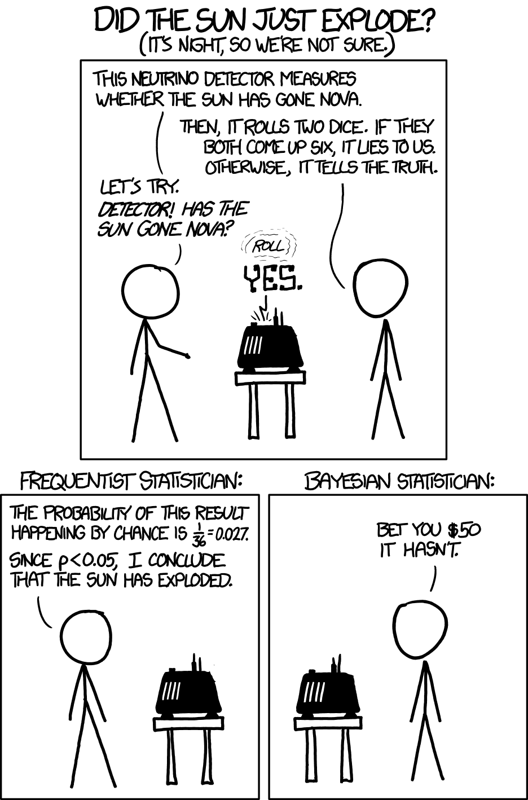
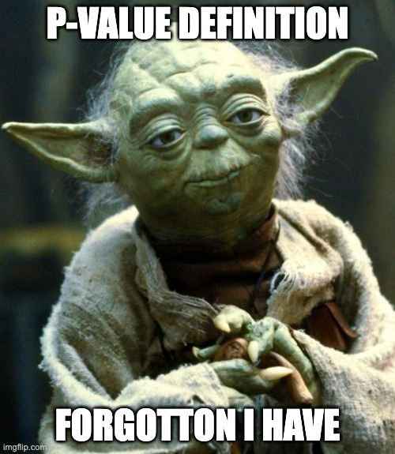

# Inference


{width="5%"}

## What is it?

Statistical inference, according to @gelman_regression_2021, chap. 1.1, faces the challenge of *generalizing* from the particular to the general.

In more details, this amounts to generalizing from ...

1.  a sample to a population
2.  a treatment to a control group (i.e., causal inference)
3.  observed measurement to the underlying ("latent") construct of interest

::: callout-important
Statistical inference is concerned with making general claims from particular data using mathematical tools.
:::

## Population and sample

We want to have an estimate of some population value, for example the proportion of `A`.

However, all we have is a subset, a sample of the populuation. Hence, we need to *infer* from the sample to the popluation. We do so by generalizing from the sample to the population, see Figure @fig-pop-sample.

::: {#fig-pop-sample layout-ncol="2"}
{#fig-pop}

{#fig-sample}

Population vs. sample (Image credit: Karsten Luebke)
:::

## What's not inference?

Consider fig. @fig-desk-inf which epitomizes the difference between *descriptive* and *inferential* statistics.


::: {.cell layout-align="center"}
::: {.cell-output-display}
{#fig-desk-inf fig-align='center' width=50%}
:::
:::


## When size helps

Larger samples allow for more precise estimations (ceteris paribus).


::: {.cell layout-align="center"}
::: {.cell-output-display}
{fig-align='center' width=70%}
:::
:::


<!--  -->

## What flavors are available?

Typically, when one hears "inference" one thinks of p-values and null hypothesis testing. Those procedures are examples of the school of *Frequentist statistics*.

However, there's a second flavor of statistics to be mentioned here: *Bayesian statistics*.

### Frequentist inference

Frequentism is *not* concerned about the probability of your research hypothesis.

Frequentism is all about controlling the *long-term error*. For illustration, suppose you are the CEO of a factory producing screws, and many of them. 
As the boss, you are not so much interested if a particular scree is in order (or faulty). 
Rather you are interested that the overall, long-term error rate of your production is low. 
One may add that your goal might not the minimize the long-term error, b
ut to control it to a certain level - it may be to expensive to produce super high quality screws. 
Some decent, but cheap screws, might be more profitable.

### Bayes inference

Bayes inference is concerned about the probability of your research hypothesis.

It simply redistributes your beliefs based on new data (evidence) you observe, 
see Figure @fig-belief-update.


:::{.cell layout-align="center"}

```{.default .cell-code}
flowchart LR
  A(prior belief) --> B(new data) --> C(posterior belief)
```

:::{.cell-output-display}

:::{#fig-belief-update}

:::{}

<pre class="mermaid mermaid-js" data-label="fig-belief-update">flowchart LR
  A(prior belief) --&gt; B(new data) --&gt; C(posterior belief)

</pre>
:::


Bayesian belief updating
:::
:::
:::


In more detail, the posterior belief is formalized as the posterior probability. The Likelihood is the probability of the data given some hypothesis. 
The normalizing constant serves to give us a number between zero and one.

$$\overbrace{\Pr(\color{blue}{H}|\color{green}{D})}^\text{posterior probability} = \overbrace{Pr(\color{blue}{H})}^\text{prior} \frac{\overbrace{Pr(\color{green}{D}|\color{blue}{H})}^\text{likelihood}}{\underbrace{Pr(\color{green}{D})}_{\text{normalizing constant}}}$$

In practice, the posterior probability of your hypothesis is, 
the average of your prior and the Likelihood of your data.

{width="70%"}


Can you see that the posterior is some average of prior and likelihood?


Check out this [great video on Bayes Theorem by 3b1b](https://youtu.be/HZGCoVF3YvM).

## But which one should I consume?

PRO Frequentist:

-   Your supervisor and reviewers will be more familiar with it
-   The technical overhead is simpler compared to Bayes

PRO Bayes:

-   You'll probably want to have a posterior probability of your hypothesis
-   You may appear as a cool kid and an early adoptor of emering statistical methods

::: callout-tip
You'll learn that the technical setup used for doing Bayes statistics is quite similar to doing frequentist statistics. Stay tuned.
:::


## Lab

Consider your (most pressing) research question. Assess whether it is more accessible via Frequentist or via Bayesian statistics. Explain your reasoning.


## Comment from xkcd


::: {.cell layout-align="center"}
::: {.cell-output-display}
{fig-align='center' width=50%}
:::
:::


[Quelle](https://xkcd.com/1132/)

## p-value

The p-value has been used as the pivotal criterion to decide about whether or not a research hypothesis were to be "accepted" (a term forbidden in frequentist and Popperian langauge) or to be rejected. However, more recently, it is advised to use the p-value only as *one* indicator among multiple; see @wasserstein_asas_2016 and @wasserstein_moving_2019.

::: callout-important
The p-value is defined as the probability of obtaining the observed data (or more extreme) under the assumption of no effect.
:::

Figure @fig-pvalue visualizes the p-value.


::: {.cell layout-align="center"}
::: {.cell-output-display}
{#fig-pvalue fig-align='center' width=50%}
:::
:::


## Some confusion remains about the p-value

{width=25%}


## Exercises

>    👨‍🏫 Check-out all exercises from [Datenwerk](https://datenwerk.netlify.app/) with the tag [inference](https://datenwerk.netlify.app/#category=inference).
For Bayesian inference, check out the tag [bayes](https://datenwerk.netlify.app/#category=bayes) on the same website.


## Going further

@goodman_dirty_2008 provides an entertaining overview on typical misconceptions of the p-value [full text](https://www.ohri.ca//newsroom/seminars/SeminarUploads/1829/Suggested%20Reading%20-%20Nov%203,%202014.pdf).
@poldrack_statistical_2022-1 provides a fresh, accessible and sound introduction to statistical inference; in addition @cetinkaya-rundel_introduction_2021-2 is a worthwhile treatise.

