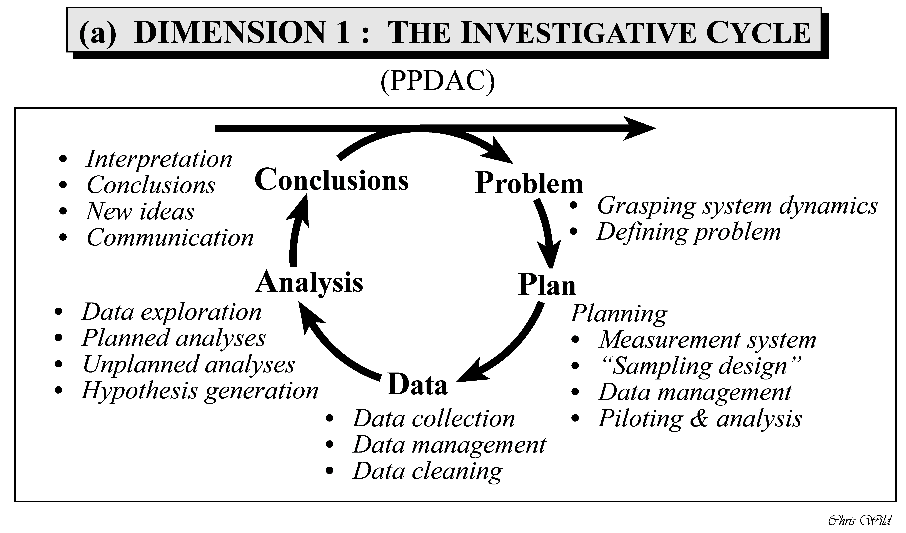
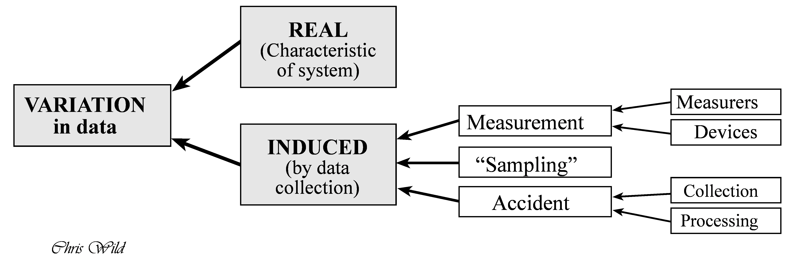

# Basics


## A framework for problem solving

### PPDAC

The PPDAC Model is a methodological framework (aka a model) for applying the scientific method to any analytical or research question, or at least it is applicable to quite a few [@mackay_scientific_2000].
It is not meant to be a rigid sequence, but rather a cycle that may turn a number of rounds like a spiral.
Statistician Chris Wild puts the PPDAC cycle in the following figure, see Figure @fig-ppdac. In [this short essay](https://www.stat.auckland.ac.nz/~wild/d2i/articles/1.4%20Place%20of%20data%20analysis%20in%20problem%20solving_ARTICLE.pdf), he summaries his ideas on how to use the PPDAC as a tool for data analysis in problem solving.

{#fig-ppdac}


Wickham and Grolemund (see Figure @fig-data-journey in @sec-data-journey) provide a suggestion of the parts of the statistical analyses, that is the "Analysis" step in the PPDAC.


### Fundamental issues in data analysis


@wild_statistical_1999  further note that variation is one of the essential characteristics of data. They discern to types of variation however, see Figure @fig-variation.

{#fig-variation}

@wild_statistical_1999 give a more systematic overview on how a quantitative research question - applied or basic - can be tackled and conceived.
For example, in their paper the authors enumarate some dispositions that researcher should embrace in order to fruitfully engage in empirical research:

- Scepticism
- Imagination
- Curiosity
- Opennness
- A propensity to seek deeper menaing
- Being logical
- Engagement
- Perseverance


## R Basics

Check out [chapter 1 in ModernDive](https://moderndive.com/1-getting-started.html) for an accessible introduction to getting started with R and RStudio.

Please also note that R and RStudio should be installed before starting (this course).


## Initial quiz


To get an idea whether you have digested some R basics, consider the following quiz.


:::{#exr-q1}

## Define a variable

Define in R the variable `age` and assign the value `42`.^[`age <- 42`, spaces are optional but useful]
:::


:::{#exr-q2}

## Define a variable as a string

Define in R the variable `name` and assign the value `me`.^[`age <- "me"`]
:::


:::{#exr-q3}

## Define a variable by another variable

Define in R the variable `name` and assign the *variable* `age`.^[`age <- age`]
:::


:::{#exr-q3a}

## Call a function

Ask R what today's  `date()` is, that is, call a function.^[`date()`]
:::


:::{#exr-q4}

## Define a vector

Define in R a vector `x` with the values 1,2,3 .^[`x <- c(1, 2, 3)`]
:::


:::{#exr-q5}

## Vector wise computation

Square each value in the vector `x`.^[`x^2`]
:::


:::{#exr-q6}

## Vector wise computation 2

Square each value in the vector `x` and sum up the values.^[`sum(x^2)`]
:::


:::{#exr-q7}

## Vector wise computation 3

Square each value in the vector `x`, sum up the values, and divide by 3.^[`mean(x^2)`]
:::

:::{#exr-q8}

## Compute the variance

Compute the variance of `x` using basic arithmetic.^[`sum(x^2)`][^sol8]
:::


[^sol8]:


    ::: {.cell hash='basics_cache/pdf/unnamed-chunk-1_4a4fc100a7ea08571d63707542057100'}
    
    ```{.r .cell-code}
    x <- c(1, 2, 3)
    
    sum((x - mean(x))^2) / (length(x)-1)
    ```
    
    ::: {.cell-output .cell-output-stdout}
    ```
    [1] 1
    ```
    :::
    
    ```{.r .cell-code}
    # compare: 
    var(x)  
    ```
    
    ::: {.cell-output .cell-output-stdout}
    ```
    [1] 1
    ```
    :::
    :::


:::{#exr-q9}

## Work with NA

Define the vector `y` with the values 1,2,NA. Compute the mean. Explain the results.^[`y <- c(1, 2, NA); mean(y)` NA (not available, ie., missing) is contagious in R: If there's a missing element, R will assume that something has gone wrong and will raise a red flag, i.e, give you a NA back.]
:::


## Data import


Check out [chapter 4 in ModernDive](https://moderndive.com/4-tidy.html) on how to import data into RStudio and for some basic concepts about "tidy data".

Spoiler: There's a button in RStudio in the "Environment" Pane saying "Import Dataset". 
Just click it, and things should work out.


## Blitz start with data {#sec-blitz-data}


To blitz start with data, type the following in R:


::: {.cell hash='basics_cache/pdf/unnamed-chunk-2_dcebb5330321a590e8688fe390b963ab'}

```{.r .cell-code}
data(mtcars)
```
:::


And the data set `mtcars` will be available.

To get help for the data set, type `help(mtcars)`


A bit more advanced, but it's a nice data set, try the Palmer Penguins data set:


::: {.cell hash='basics_cache/pdf/unnamed-chunk-3_0f6fb25478ce210dc1f03577a3ff3d28'}

```{.r .cell-code}
d <- read.csv("https://vincentarelbundock.github.io/Rdatasets/csv/palmerpenguins/penguins.csv")

head(d)  # see the first few rows, the "head" of the table
```

::: {.cell-output .cell-output-stdout}
```
  X species    island bill_length_mm bill_depth_mm flipper_length_mm
1 1  Adelie Torgersen           39.1          18.7               181
2 2  Adelie Torgersen           39.5          17.4               186
3 3  Adelie Torgersen           40.3          18.0               195
4 4  Adelie Torgersen             NA            NA                NA
5 5  Adelie Torgersen           36.7          19.3               193
6 6  Adelie Torgersen           39.3          20.6               190
  body_mass_g    sex year
1        3750   male 2007
2        3800 female 2007
3        3250 female 2007
4          NA   <NA> 2007
5        3450 female 2007
6        3650   male 2007
```
:::
:::


Here's some [documentation (code book)](https://vincentarelbundock.github.io/Rdatasets/doc/palmerpenguins/penguins.html) for this data set.


## More data set 


Check out [this curated list](https://data-se.netlify.app/2022/02/23/data-sets-for-for-teaching/) of data sets useful for learning and practicing your data skills.


## Literature


@wild_statistical_1999 discuss the thougnht processes involved in statistical problem solving seen from a broad perspective.
@ismay_statistical_2020 is a helpful start into the first steps in R.


