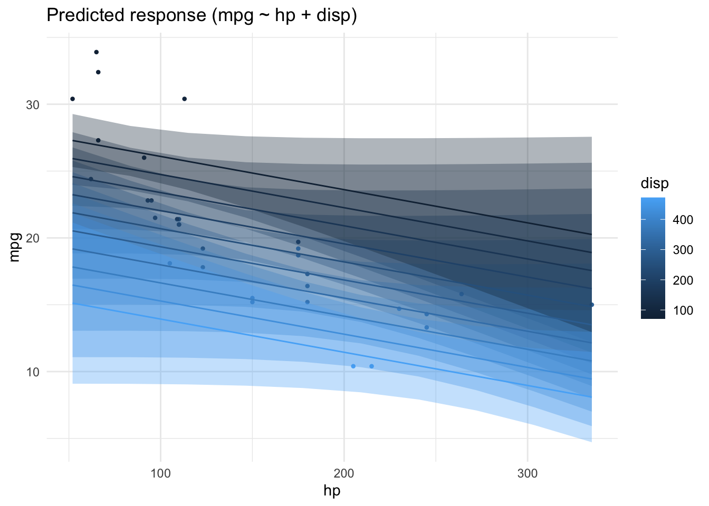
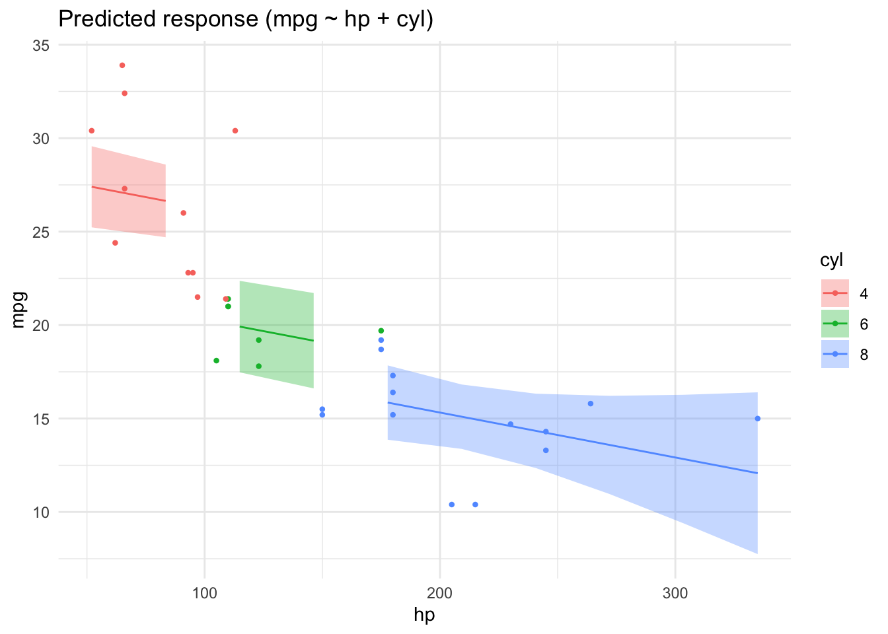

# Modelling and regression

{width="5%"}


## R packages needed for this chapter


::: {.cell layout-align="center"}

```{.r .cell-code}
library(easystats)
library(tidyverse)
library(rstanarm)  # optional!
```
:::

::: {.cell layout-align="center"}

:::


## What's modelling?

[Read this great introduction by modelling by Russel Poldrack](https://statsthinking21.github.io/statsthinking21-core-site/fitting-models.html#what-is-a-model). Actually, the whole book is nice @poldrack_statistical_2022.


An epitome of modelling is this, let's call it the fundamental modelling equation, a bit grandiose but at the point, see @eq-modelling.


The data can be separated in the model's prediction and the rest (the "error"), i.e., what's unaccounted for by the model.

$$
\text{data} = \text{model} + \text{error}
$${#eq-modelling}


A more visual account of our basic modelling equation is depicted in @fig-model1.


:::{.cell layout-align="default"}

:::{.cell-output-display}

:::{#fig-model1}

:::{}

<pre class="mermaid mermaid-js" data-label="fig-model1">flowchart LR
  X --&gt; Y
  error --&gt; Y
</pre>
:::


A more visual account of our basic modelling equation
:::
:::
:::


## Regression as the umbrella tool for modelling

{width="50%"}

[Source: Image Flip](www.imgflip.com)

Alternatively, venture into the forest of statistical tests as [outlined e.g. here, at Uni Muenster](https://web.archive.org/web/20091029162244/http://www.wiwi.uni-muenster.de/ioeb/en/organisation/pfaff/stat_overview_table.html). Proceed at your own peril.

You may want to ponder on this image of a decision tree of which test to choose, see Figure @fig-choose-test.

{#fig-choose-test}

### Common statistical tests are linear models

As Jonas Kristoffer Lindeløv tells us, we can formulate most statistical tests as a linear model, ie., a regression.

{width=75%}

### How to find the regression line

In the simplest case, regression analyses can be interpreted geometrically as a line in a 2D coordinate system, see Figure @fig-regr1.

{#fig-regr1}

[Source: Orzetoo, CC-SA, Wikimedia](https://commons.wikimedia.org/wiki/File:Coefficient_of_Determination.svg)

Put simple, we are looking for the line which is in the "middle of the points". More precisely, we place the line such that the squared distances from the line to the points is minimal, see Figre @fig-regr1.

Consider Figure @fig-regr2, from [this source](https://bookdown.org/roback/bookdown-BeyondMLR/ch-MLRreview.html#assumptions-for-linear-least-squares-regression) by @roback_beyond_2021. It visualizes not only the notorious regression line, but also sheds light on regression assumptions, particularly on the error distribution.

{#fig-regr2}

Among the assumptions of the linear model are:

- linearity of the function
- variance of $y$ remains constant across range of $x$
- normality of residuals


### The linear model

Here's the canonical form of the linear model.

Consider a model with $k$ predictors:

$$y = \beta_0 + \beta_1 x_1 + \ldots + \beta_k x_k + \epsilon$$

### Algebraic derivation

For the mathematical inclined, check out [this derivation](https://data-se.netlify.app/2022/05/23/ableitung-der-koeffizienten-der-einfachen-regression/) of the simple case regression model. Note that the article is written in German, but your browser can effortlessly translate into English. Here's a [similar English article from StackExchange](https://math.stackexchange.com/questions/716826/derivation-of-simple-linear-regression-parameters).


## In all its glory


::: {.cell layout-align="center"}
::: {.cell-output-display}
{fig-align='center' width=70%}
:::
:::


Let's depict the residuals, s. @fig-lm2.


::: {.cell layout-align="center"}
::: {.cell-output-display}
{#fig-lm2 fig-align='center' width=70%}
:::
:::


## First model: one metric predictor

First, let's load some data:


::: {.cell layout-align="center"}

```{.r .cell-code}
data(mtcars)
glimpse(mtcars)
```

::: {.cell-output .cell-output-stdout}

```
Rows: 32
Columns: 11
$ mpg  <dbl> 21.0, 21.0, 22.8, 21.4, 18.7, 18.1, 14.3, 24.4, 22.8, 19.2, 17.8,…
$ cyl  <dbl> 6, 6, 4, 6, 8, 6, 8, 4, 4, 6, 6, 8, 8, 8, 8, 8, 8, 4, 4, 4, 4, 8,…
$ disp <dbl> 160.0, 160.0, 108.0, 258.0, 360.0, 225.0, 360.0, 146.7, 140.8, 16…
$ hp   <dbl> 110, 110, 93, 110, 175, 105, 245, 62, 95, 123, 123, 180, 180, 180…
$ drat <dbl> 3.90, 3.90, 3.85, 3.08, 3.15, 2.76, 3.21, 3.69, 3.92, 3.92, 3.92,…
$ wt   <dbl> 2.620, 2.875, 2.320, 3.215, 3.440, 3.460, 3.570, 3.190, 3.150, 3.…
$ qsec <dbl> 16.46, 17.02, 18.61, 19.44, 17.02, 20.22, 15.84, 20.00, 22.90, 18…
$ vs   <dbl> 0, 0, 1, 1, 0, 1, 0, 1, 1, 1, 1, 0, 0, 0, 0, 0, 0, 1, 1, 1, 1, 0,…
$ am   <dbl> 1, 1, 1, 0, 0, 0, 0, 0, 0, 0, 0, 0, 0, 0, 0, 0, 0, 1, 1, 1, 0, 0,…
$ gear <dbl> 4, 4, 4, 3, 3, 3, 3, 4, 4, 4, 4, 3, 3, 3, 3, 3, 3, 4, 4, 4, 3, 3,…
$ carb <dbl> 4, 4, 1, 1, 2, 1, 4, 2, 2, 4, 4, 3, 3, 3, 4, 4, 4, 1, 2, 1, 1, 2,…
```


:::
:::


### Frequentist

Define and fit the model:


::: {.cell layout-align="center"}

```{.r .cell-code}
lm1_freq <- lm(mpg ~ hp, data = mtcars)
```
:::


Get the parameter values:


::: {.cell layout-align="center"}

```{.r .cell-code}
parameters(lm1_freq)
```

::: {.cell-output-display}
<div class="kable-table">

|Parameter   | Coefficient|        SE|   CI|     CI_low|    CI_high|         t| df_error|     p|
|:-----------|-----------:|---------:|----:|----------:|----------:|---------:|--------:|-----:|
|(Intercept) |  30.0988605| 1.6339210| 0.95| 26.7619488| 33.4357723| 18.421246|       30| 0e+00|
|hp          |  -0.0682283| 0.0101193| 0.95| -0.0888947| -0.0475619| -6.742388|       30| 2e-07|

</div>
:::
:::


Plot the model parameters:


::: {.cell layout-align="center"}

```{.r .cell-code}
plot(parameters(lm1_freq))
```

::: {.cell-output-display}
{fig-align='center' width=70%}
:::
:::


### Bayesian


::: {.cell layout-align="center"}

```{.r .cell-code}
lm1_bayes <- stan_glm(mpg ~ hp, data = mtcars)
```

::: {.cell-output .cell-output-stdout}

```

SAMPLING FOR MODEL 'continuous' NOW (CHAIN 1).
Chain 1: 
Chain 1: Gradient evaluation took 0.004213 seconds
Chain 1: 1000 transitions using 10 leapfrog steps per transition would take 42.13 seconds.
Chain 1: Adjust your expectations accordingly!
Chain 1: 
Chain 1: 
Chain 1: Iteration:    1 / 2000 [  0%]  (Warmup)
Chain 1: Iteration:  200 / 2000 [ 10%]  (Warmup)
Chain 1: Iteration:  400 / 2000 [ 20%]  (Warmup)
Chain 1: Iteration:  600 / 2000 [ 30%]  (Warmup)
Chain 1: Iteration:  800 / 2000 [ 40%]  (Warmup)
Chain 1: Iteration: 1000 / 2000 [ 50%]  (Warmup)
Chain 1: Iteration: 1001 / 2000 [ 50%]  (Sampling)
Chain 1: Iteration: 1200 / 2000 [ 60%]  (Sampling)
Chain 1: Iteration: 1400 / 2000 [ 70%]  (Sampling)
Chain 1: Iteration: 1600 / 2000 [ 80%]  (Sampling)
Chain 1: Iteration: 1800 / 2000 [ 90%]  (Sampling)
Chain 1: Iteration: 2000 / 2000 [100%]  (Sampling)
Chain 1: 
Chain 1:  Elapsed Time: 0.059 seconds (Warm-up)
Chain 1:                0.055 seconds (Sampling)
Chain 1:                0.114 seconds (Total)
Chain 1: 

SAMPLING FOR MODEL 'continuous' NOW (CHAIN 2).
Chain 2: 
Chain 2: Gradient evaluation took 2e-05 seconds
Chain 2: 1000 transitions using 10 leapfrog steps per transition would take 0.2 seconds.
Chain 2: Adjust your expectations accordingly!
Chain 2: 
Chain 2: 
Chain 2: Iteration:    1 / 2000 [  0%]  (Warmup)
Chain 2: Iteration:  200 / 2000 [ 10%]  (Warmup)
Chain 2: Iteration:  400 / 2000 [ 20%]  (Warmup)
Chain 2: Iteration:  600 / 2000 [ 30%]  (Warmup)
Chain 2: Iteration:  800 / 2000 [ 40%]  (Warmup)
Chain 2: Iteration: 1000 / 2000 [ 50%]  (Warmup)
Chain 2: Iteration: 1001 / 2000 [ 50%]  (Sampling)
Chain 2: Iteration: 1200 / 2000 [ 60%]  (Sampling)
Chain 2: Iteration: 1400 / 2000 [ 70%]  (Sampling)
Chain 2: Iteration: 1600 / 2000 [ 80%]  (Sampling)
Chain 2: Iteration: 1800 / 2000 [ 90%]  (Sampling)
Chain 2: Iteration: 2000 / 2000 [100%]  (Sampling)
Chain 2: 
Chain 2:  Elapsed Time: 0.06 seconds (Warm-up)
Chain 2:                0.057 seconds (Sampling)
Chain 2:                0.117 seconds (Total)
Chain 2: 

SAMPLING FOR MODEL 'continuous' NOW (CHAIN 3).
Chain 3: 
Chain 3: Gradient evaluation took 1.8e-05 seconds
Chain 3: 1000 transitions using 10 leapfrog steps per transition would take 0.18 seconds.
Chain 3: Adjust your expectations accordingly!
Chain 3: 
Chain 3: 
Chain 3: Iteration:    1 / 2000 [  0%]  (Warmup)
Chain 3: Iteration:  200 / 2000 [ 10%]  (Warmup)
Chain 3: Iteration:  400 / 2000 [ 20%]  (Warmup)
Chain 3: Iteration:  600 / 2000 [ 30%]  (Warmup)
Chain 3: Iteration:  800 / 2000 [ 40%]  (Warmup)
Chain 3: Iteration: 1000 / 2000 [ 50%]  (Warmup)
Chain 3: Iteration: 1001 / 2000 [ 50%]  (Sampling)
Chain 3: Iteration: 1200 / 2000 [ 60%]  (Sampling)
Chain 3: Iteration: 1400 / 2000 [ 70%]  (Sampling)
Chain 3: Iteration: 1600 / 2000 [ 80%]  (Sampling)
Chain 3: Iteration: 1800 / 2000 [ 90%]  (Sampling)
Chain 3: Iteration: 2000 / 2000 [100%]  (Sampling)
Chain 3: 
Chain 3:  Elapsed Time: 0.06 seconds (Warm-up)
Chain 3:                0.058 seconds (Sampling)
Chain 3:                0.118 seconds (Total)
Chain 3: 

SAMPLING FOR MODEL 'continuous' NOW (CHAIN 4).
Chain 4: 
Chain 4: Gradient evaluation took 2e-05 seconds
Chain 4: 1000 transitions using 10 leapfrog steps per transition would take 0.2 seconds.
Chain 4: Adjust your expectations accordingly!
Chain 4: 
Chain 4: 
Chain 4: Iteration:    1 / 2000 [  0%]  (Warmup)
Chain 4: Iteration:  200 / 2000 [ 10%]  (Warmup)
Chain 4: Iteration:  400 / 2000 [ 20%]  (Warmup)
Chain 4: Iteration:  600 / 2000 [ 30%]  (Warmup)
Chain 4: Iteration:  800 / 2000 [ 40%]  (Warmup)
Chain 4: Iteration: 1000 / 2000 [ 50%]  (Warmup)
Chain 4: Iteration: 1001 / 2000 [ 50%]  (Sampling)
Chain 4: Iteration: 1200 / 2000 [ 60%]  (Sampling)
Chain 4: Iteration: 1400 / 2000 [ 70%]  (Sampling)
Chain 4: Iteration: 1600 / 2000 [ 80%]  (Sampling)
Chain 4: Iteration: 1800 / 2000 [ 90%]  (Sampling)
Chain 4: Iteration: 2000 / 2000 [100%]  (Sampling)
Chain 4: 
Chain 4:  Elapsed Time: 0.059 seconds (Warm-up)
Chain 4:                0.058 seconds (Sampling)
Chain 4:                0.117 seconds (Total)
Chain 4: 
```


:::
:::


Actually, we want to suppress some overly verbose output of the sampling, so add the argument `refresh = 0`:


::: {.cell layout-align="center"}

```{.r .cell-code}
lm1_bayes <- stan_glm(mpg ~ hp, data = mtcars, refresh = 0)
```
:::


Get the parameter values:


::: {.cell layout-align="center"}

```{.r .cell-code}
parameters(lm1_bayes)
```

::: {.cell-output-display}
<div class="kable-table">

|Parameter   |     Median|   CI|     CI_low|    CI_high| pd|      Rhat|      ESS|Prior_Distribution | Prior_Location| Prior_Scale|
|:-----------|----------:|----:|----------:|----------:|--:|---------:|--------:|:------------------|--------------:|-----------:|
|(Intercept) | 30.0130467| 0.95| 26.7403264| 33.3658922|  1| 0.9997042| 3737.681|normal             |       20.09062|  15.0673701|
|hp          | -0.0676743| 0.95| -0.0885522| -0.0467852|  1| 0.9998273| 3836.318|normal             |        0.00000|   0.2197599|

</div>
:::
:::


Plot the model parameters:


::: {.cell layout-align="center"}

```{.r .cell-code}
plot(parameters(lm1_bayes))
```

::: {.cell-output-display}
{fig-align='center' width=70%}
:::
:::


### Model performance


::: {.cell layout-align="center"}

```{.r .cell-code}
r2(lm1_freq)
```

::: {.cell-output .cell-output-stdout}

```
# R2 for Linear Regression
       R2: 0.602
  adj. R2: 0.589
```


:::
:::

::: {.cell layout-align="center"}

```{.r .cell-code}
r2(lm1_bayes)
```

::: {.cell-output .cell-output-stdout}

```
# Bayesian R2 with Compatibility Interval

  Conditional R2: 0.586 (95% CI [0.382, 0.760])
```


:::
:::


### Model check

Here's a bunch of typical model checks in the Frequentist sense.


::: {.cell layout-align="center" fit-width='10'}

```{.r .cell-code}
check_model(lm1_freq)
```

::: {.cell-output-display}
{fig-align='center' width=100%}
:::
:::


And here are some Bayesian flavored model checks.


::: {.cell layout-align="center" fit-width='10'}

```{.r .cell-code}
check_model(lm1_bayes)
```

::: {.cell-output-display}
{fig-align='center' width=100%}
:::
:::


### Get some predictions


::: {.cell layout-align="center"}

```{.r .cell-code}
lm1_pred <- estimate_relation(lm1_freq)
lm1_pred
```

::: {.cell-output-display}
<div class="kable-table">

|        hp| Predicted|        SE|    CI_low|  CI_high|
|---------:|---------:|---------:|---------:|--------:|
|  52.00000| 26.550990| 1.1766139| 24.148024| 28.95396|
|  83.44444| 24.405590| 0.9358933| 22.494241| 26.31694|
| 114.88889| 22.260189| 0.7548971| 20.718484| 23.80190|
| 146.33333| 20.114789| 0.6828911| 18.720139| 21.50944|
| 177.77778| 17.969389| 0.7518697| 16.433866| 19.50491|
| 209.22222| 15.823989| 0.9310065| 13.922620| 17.72536|
| 240.66667| 13.678588| 1.1707841| 11.287528| 16.06965|
| 272.11111| 11.533188| 1.4412478|  8.589767| 14.47661|
| 303.55556|  9.387788| 1.7280486|  5.858642| 12.91693|
| 335.00000|  7.242387| 2.0242544|  3.108308| 11.37647|

</div>
:::
:::


More details on the above function can be found on the [respective page at the easystats site](https://easystats.github.io/modelbased/reference/estimate_expectation.html#functions-for-estimating-predicted-values-and-uncertainty).

### Plot the model


::: {.cell layout-align="center"}

```{.r .cell-code}
plot(lm1_pred)
```

::: {.cell-output-display}
{fig-align='center' width=70%}
:::
:::


## More of this

More technical details for gauging model performance and model quality, can be found on the site of [the R package "performance](https://easystats.github.io/performance/) at the easystats site.


## Lab

Run a simple regression on your own research data. Present the results. Did you encounter any glitches?


## Bayes-members only

Bayes statistics provide a distribution as the result of the analysis, the posterior distribution, which provides us with quite some luxury.

As the posterior distribution manifests itself by a number of samples, we can easily filter and manipulate this sample distribution in order to ask some interesing questions.

See


::: {.cell layout-align="center"}

```{.r .cell-code}
lm1_bayes_tibble <- as_tibble(lm1_bayes)  # cast as a tibble (table)

head(lm1_bayes_tibble)  # show the first few rows
```

::: {.cell-output-display}
<div class="kable-table">

| (Intercept)|         hp|    sigma|
|-----------:|----------:|--------:|
|    29.70189| -0.0677765| 3.072381|
|    30.78440| -0.0714437| 5.038834|
|    29.70498| -0.0672385| 2.710406|
|    29.87562| -0.0628599| 5.004923|
|    27.27882| -0.0547451| 3.282582|
|    33.61258| -0.0868183| 4.891969|

</div>
:::
:::


### Asking for probabilites

*What's the probability that the effect of hp is negative?*


::: {.cell layout-align="center"}

```{.r .cell-code}
lm1_bayes_tibble %>% 
  count(hp < 0)
```

::: {.cell-output-display}
<div class="kable-table">

|hp < 0 |    n|
|:------|----:|
|TRUE   | 4000|

</div>
:::
:::


Feel free to ask similar questions!

### Asking for quantiles

*With a given probability of, say 90%, how large is the effect of hp?*


::: {.cell layout-align="center"}

```{.r .cell-code}
quantile(lm1_bayes_tibble$hp, .9)
```

::: {.cell-output .cell-output-stdout}

```
        90% 
-0.05424696 
```


:::
:::


*What's the smallest 95% percent interval for the effect of hp?*


::: {.cell layout-align="center"}

```{.r .cell-code}
hdi(lm1_bayes)
```

::: {.cell-output-display}
<div class="kable-table">

|Parameter   |   CI|     CI_low|    CI_high|Effects |Component   |
|:-----------|----:|----------:|----------:|:-------|:-----------|
|(Intercept) | 0.95| 26.6464888| 33.2506932|fixed   |conditional |
|hp          | 0.95| -0.0899743| -0.0484453|fixed   |conditional |

</div>
:::
:::


In case you prefer 89% intervals (I do!):


::: {.cell layout-align="center"}

```{.r .cell-code}
hdi(lm1_bayes, ci = .89)
```

::: {.cell-output-display}
<div class="kable-table">

|Parameter   |   CI|     CI_low|    CI_high|Effects |Component   |
|:-----------|----:|----------:|----------:|:-------|:-----------|
|(Intercept) | 0.89| 27.4433208| 32.8529059|fixed   |conditional |
|hp          | 0.89| -0.0844008| -0.0509433|fixed   |conditional |

</div>
:::
:::


### Model specification

In Bayes statistics, it is customary to specify the model in something like the following way:


$$\begin{aligned}
y_i &\sim N(\mu_i,\sigma)\\
\mu_i &= \beta_0 + \beta_1 x_i\\
\beta_0, \beta_1 &\sim N(0, 1) \\
\sigma &\sim E(1)
\end{aligned}$$

In this specification, $N$ refers to the normal distribution, and $E$ to the exponential distribution.
Furthermore, this model assumes that the $X$ and $Y$ are given in standard units.


### Prediction interval

A prediction interval answers the following question


>   How large is the uncertainty in $y$ associated with a given obersation? What interval of values should I expect for a randomly chosen observation?


For example, what's the uncertainty attached to the fuel economy of a car with 100 hp?


::: {.cell layout-align="center"}

```{.r .cell-code}
estimate_prediction(model = lm1_bayes, 
                    data = tibble(hp = 100) )
```

::: {.cell-output-display}
<div class="kable-table">

|  hp| Predicted|       SE|   CI_low|  CI_high|
|---:|---------:|--------:|--------:|--------:|
| 100|  23.17271| 4.160322| 15.16662| 31.30061|

</div>
:::
:::


### ... And more

We could even ask intriguing questions such as 


>   Given the model, and given two random observations, one from the experimental group and one from the control group, what is the probability that observation 1 has a higher value in $Y$ than observation 2 has?

Note that we are not only asking for "typical" observations as predicted by the model but we are also taking into account the uncertainty of the prediction for each group. 
Hence, *this* kind of questions is likely to yield more realistic (and less clear-cut) answers than just asking for the typical value.
In other words, such analyses draw on the posterior predictive distribution.


## Multiple metric predictors

Assume we have a theory that dictates that fuel economy is a (causal) function of horse power and engine displacement.


::: {.cell layout-align="center"}

```{.r .cell-code}
lm2_freq <- lm(mpg ~ hp + disp, data = mtcars)
parameters(lm2_freq)
```

::: {.cell-output-display}
<div class="kable-table">

|Parameter   | Coefficient|        SE|   CI|     CI_low|    CI_high|         t| df_error|         p|
|:-----------|-----------:|---------:|----:|----------:|----------:|---------:|--------:|---------:|
|(Intercept) |  30.7359042| 1.3315661| 0.95| 28.0125457| 33.4592628| 23.082522|       29| 0.0000000|
|hp          |  -0.0248401| 0.0133855| 0.95| -0.0522165|  0.0025363| -1.855746|       29| 0.0736791|
|disp        |  -0.0303463| 0.0074049| 0.95| -0.0454909| -0.0152016| -4.098159|       29| 0.0003063|

</div>
:::
:::


Similarly for Bayes inference:


::: {.cell layout-align="center"}

```{.r .cell-code}
lm2_bayes <- stan_glm(mpg ~ hp + disp, data = mtcars)
```
:::


Results


::: {.cell layout-align="center"}

```{.r .cell-code}
parameters(lm2_bayes)
```

::: {.cell-output-display}
<div class="kable-table">

|Parameter   |     Median|   CI|     CI_low|    CI_high|      pd|     Rhat|      ESS|Prior_Distribution | Prior_Location| Prior_Scale|
|:-----------|----------:|----:|----------:|----------:|-------:|--------:|--------:|:------------------|--------------:|-----------:|
|(Intercept) | 30.7309468| 0.95| 27.8683708| 33.3556538| 1.00000| 1.000524| 3921.620|normal             |       20.09062|  15.0673701|
|hp          | -0.0248306| 0.95| -0.0513051|  0.0040632| 0.96075| 1.000970| 1962.597|normal             |        0.00000|   0.2197599|
|disp        | -0.0301813| 0.95| -0.0458832| -0.0151743| 1.00000| 1.002863| 1920.949|normal             |        0.00000|   0.1215712|

</div>
:::

```{.r .cell-code}
plot(parameters(lm2_bayes))
```

::: {.cell-output-display}
{fig-align='center' width=70%}
:::

```{.r .cell-code}
r2(lm2_bayes)
```

::: {.cell-output .cell-output-stdout}

```
# Bayesian R2 with Compatibility Interval

  Conditional R2: 0.730 (95% CI [0.563, 0.838])
```


:::
:::


Depending on the value of `disp` the prediction of `mpg` from `hp` will vary:


::: {.cell layout-align="center"}

```{.r .cell-code}
lm2_pred <- estimate_relation(lm2_freq)
plot(lm2_pred)
```

::: {.cell-output-display}
{fig-align='center' width=70%}
:::
:::


## One nominal predictor


::: {.cell layout-align="center"}

```{.r .cell-code}
lm3a <- lm(mpg ~ am, data = mtcars)
parameters(lm3a)
```

::: {.cell-output-display}
<div class="kable-table">

|Parameter   | Coefficient|       SE|   CI|   CI_low|  CI_high|         t| df_error|        p|
|:-----------|-----------:|--------:|----:|--------:|--------:|---------:|--------:|--------:|
|(Intercept) |   17.147368| 1.124602| 0.95| 14.85062| 19.44411| 15.247492|       30| 0.000000|
|am          |    7.244939| 1.764422| 0.95|  3.64151| 10.84837|  4.106127|       30| 0.000285|

</div>
:::
:::

::: {.cell layout-align="center"}

```{.r .cell-code}
lm3a_means <- estimate_means(lm3a, at = "am = c(0, 1)")
lm3a_means 
```

::: {.cell-output-display}
<div class="kable-table">

| am|     Mean|       SE|   CI_low|  CI_high|
|--:|--------:|--------:|--------:|--------:|
|  0| 17.14737| 1.124602| 14.85062| 19.44411|
|  1| 24.39231| 1.359578| 21.61568| 27.16894|

</div>
:::
:::

If we were not to specify the values of `am` which we would like to get predictions for, the default of the function would select 10 values, spread across the range of `am`. For numeric variables, this is usually fine. However, for nominal variables - and `am` is in fact a nominally scaled variable - we insist that we want predictions for the levels of the variable only, that is for `0` and `1`.


However, unfortunately, the plot *needs* a nominal variable if we are to compare groups. 
In our case, `am` is considered a numeric variables, since it consists of numbers only. 
The plot does not work, malheureusement:


::: {.cell layout-align="center"}

```{.r .cell-code}
plot(lm3a_means)
```

::: {.cell-output .cell-output-error}

```
Error in `rlang::sym()`:
! Can't convert a character vector to a symbol.
```


:::
:::


We need to transform `am` to a factor variable. That's something like a string. 
If we hand over a `factor()` to the plotting function, everything will run smoothly. 
Computationwise, no big differences:


::: {.cell layout-align="center"}

```{.r .cell-code}
mtcars2 <-
  mtcars %>% 
  mutate(am_f = factor(am))

lm3a <- lm(mpg ~ am_f, data = mtcars2)
parameters(lm3a)
```

::: {.cell-output-display}
<div class="kable-table">

|Parameter   | Coefficient|       SE|   CI|   CI_low|  CI_high|         t| df_error|        p|
|:-----------|-----------:|--------:|----:|--------:|--------:|---------:|--------:|--------:|
|(Intercept) |   17.147368| 1.124602| 0.95| 14.85062| 19.44411| 15.247492|       30| 0.000000|
|am_f1       |    7.244939| 1.764422| 0.95|  3.64151| 10.84837|  4.106127|       30| 0.000285|

</div>
:::
:::

::: {.cell layout-align="center"}

```{.r .cell-code}
lm3a_means <- estimate_means(lm3a)
plot(lm3a_means)
```

::: {.cell-output-display}
{fig-align='center' width=70%}
:::
:::


Note that we should have converted `am` to a factor variable before fitting the model. Otherwise, the plot won't work.

Here's a more hand-crafted version of the last plot, see Fig. @fig-lm3a-means.


::: {.cell layout-align="center"}

```{.r .cell-code}
ggplot(mtcars2) +
  aes(x = am_f, y = mpg) +
  geom_violin() +
  geom_jitter(width = .1, alpha = .5) +
  geom_pointrange(data = lm3a_means,
                  color = "orange",
                  aes(ymin = CI_low, ymax = CI_high, y = Mean)) +
  geom_line(data = lm3a_means, aes(y = Mean, group = 1))
```

::: {.cell-output-display}
{#fig-lm3a-means fig-align='center' width=70%}
:::
:::


## One metric and one nominal predictor


::: {.cell layout-align="center"}

```{.r .cell-code}
mtcars2 <-
  mtcars %>% 
  mutate(cyl = factor(cyl))

lm4 <- lm(mpg ~ hp + cyl, data = mtcars2)
parameters(lm4)
```

::: {.cell-output-display}
<div class="kable-table">

|Parameter   | Coefficient|        SE|   CI|      CI_low|    CI_high|         t| df_error|         p|
|:-----------|-----------:|---------:|----:|-----------:|----------:|---------:|--------:|---------:|
|(Intercept) |  28.6501182| 1.5877870| 0.95|  25.3976840| 31.9025524| 18.044056|       28| 0.0000000|
|hp          |  -0.0240388| 0.0154079| 0.95|  -0.0556005|  0.0075228| -1.560163|       28| 0.1299540|
|cyl6        |  -5.9676551| 1.6392776| 0.95|  -9.3255631| -2.6097471| -3.640418|       28| 0.0010921|
|cyl8        |  -8.5208508| 2.3260749| 0.95| -13.2855993| -3.7561022| -3.663188|       28| 0.0010286|

</div>
:::
:::

::: {.cell layout-align="center"}

```{.r .cell-code}
lm4_pred <- estimate_relation(lm4)
plot(lm4_pred)
```

::: {.cell-output-display}
{fig-align='center' width=70%}
:::
:::


## Watch out for Simpson

Beware! Model estimates can swing wildly if you add (or remove) some predictor from your model. [See this post](https://ecologyforthemasses.com/2022/06/08/who-is-simpson-and-what-does-his-paradox-mean-for-ecologists/) for an demonstration.


## What about correlation?

Correlation is really a close cousin to regression. In fact, regression with standardized variables amounts to correlation.

Let's get the correlation matrix of the variables in involved in `lm4`.


::: {.cell layout-align="center"}

```{.r .cell-code}
lm4_corr <- 
  mtcars %>% 
  select(mpg, hp, disp) %>% 
  correlation()

lm4_corr
```

::: {.cell-output-display}
<div class="kable-table">

|Parameter1 |Parameter2 |          r|   CI|     CI_low|    CI_high|         t| df_error|     p|Method              | n_Obs|
|:----------|:----------|----------:|----:|----------:|----------:|---------:|--------:|-----:|:-------------------|-----:|
|mpg        |hp         | -0.7761684| 0.95| -0.8852686| -0.5860994| -6.742388|       30| 2e-07|Pearson correlation |    32|
|mpg        |disp       | -0.8475514| 0.95| -0.9233594| -0.7081376| -8.747151|       30| 0e+00|Pearson correlation |    32|
|hp         |disp       |  0.7909486| 0.95|  0.6106794|  0.8932775|  7.080122|       30| 1e-07|Pearson correlation |    32|

</div>
:::
:::

::: {.cell layout-align="center"}

```{.r .cell-code}
plot(summary(lm4_corr))
```

::: {.cell-output-display}
{fig-align='center' width=70%}
:::
:::


## Exercises

1.  [mtcars simple 1](https://datenwerk.netlify.app/posts/mtcars-simple1/mtcars-simple1/)
2.  [mtcars simple 2](https://datenwerk.netlify.app/posts/mtcars-simple2/mtcars-simple2/)
3.  [mtcars simple 3](https://datenwerk.netlify.app/posts/mtcars-simple3/mtcars-simple3/)

>   🧑‍🎓 I want more!

>   👨‍🏫 Checkout all [exercises tagges with "regression"](https://datenwerk.netlify.app/#category=regression) on [datenwerk](https://datenwerk.netlify.app/). Pro-Tipp: Use the translation function of your browers to translate the webpage into your favorite language.

## Lab

Get your own data, and build a simple model reflecting your research hypothesis. If you are lacking data (or hypothesis) get something close to it.

## Literature

An accessible treatment of regression is provided by @ismay_statistical_2020.

@roback_beyond_2021 provide a more than introductory account of regression while being accessible. A recent but already classic book (if this is possible) is the book by @gelman_regression_2021.
You may also benefit from @poldrack_statistical_2022 (open access).

## Debrief

[Science!](https://media.giphy.com/media/141amBdjqs9Vvy/giphy.gif)
