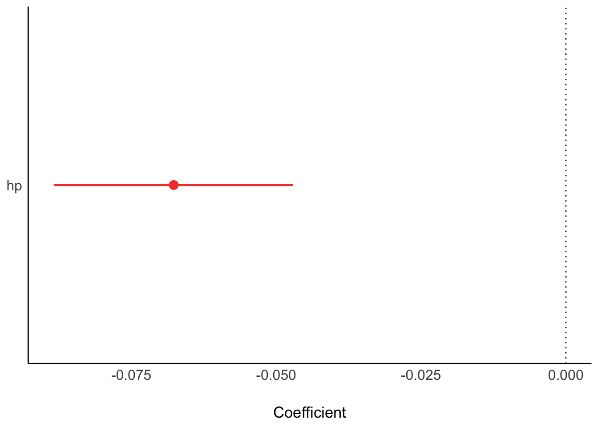
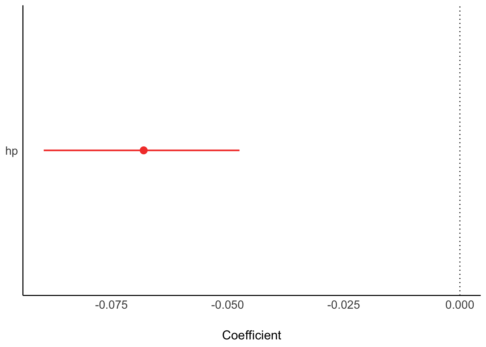
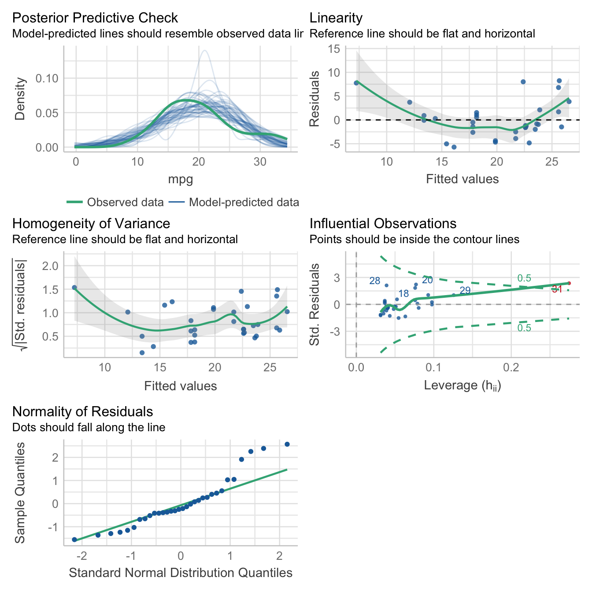
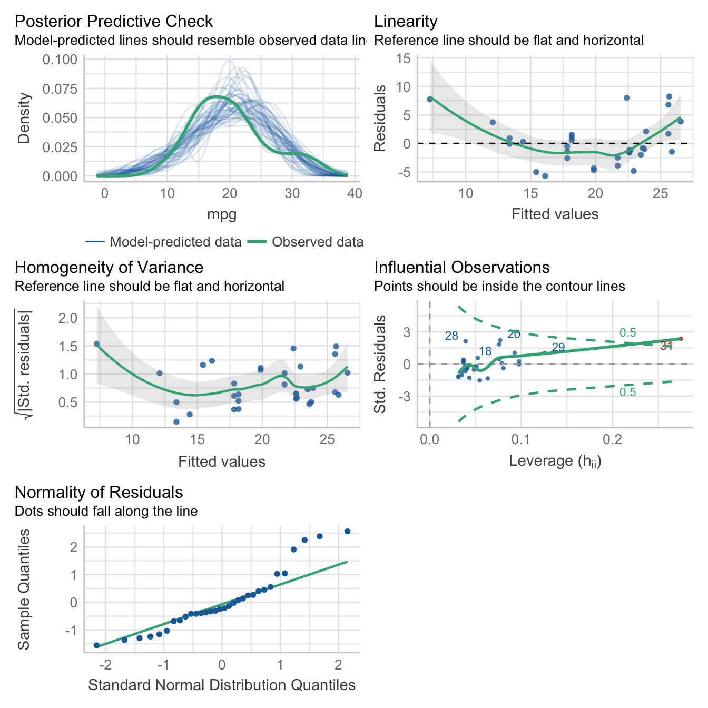
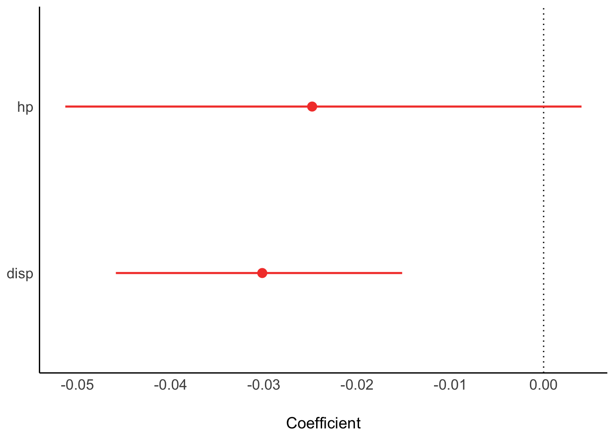
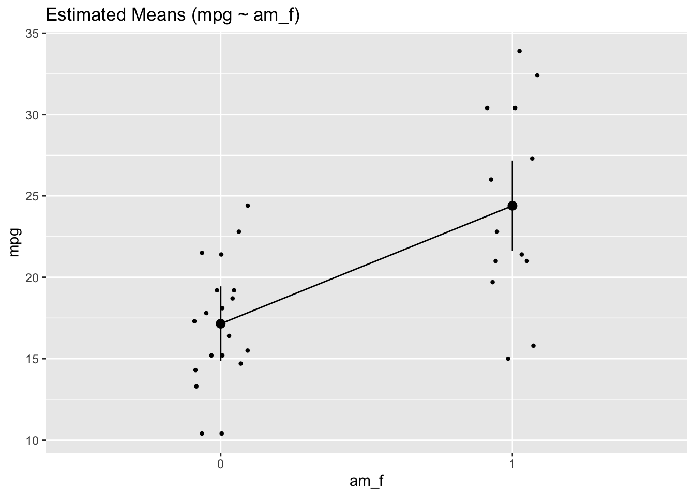
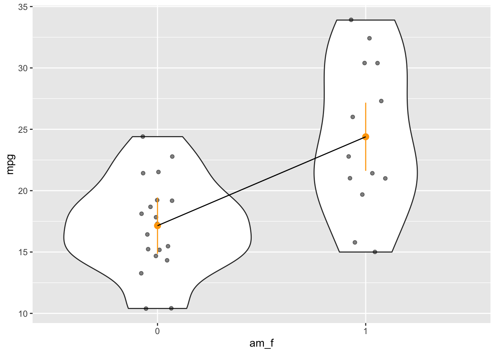
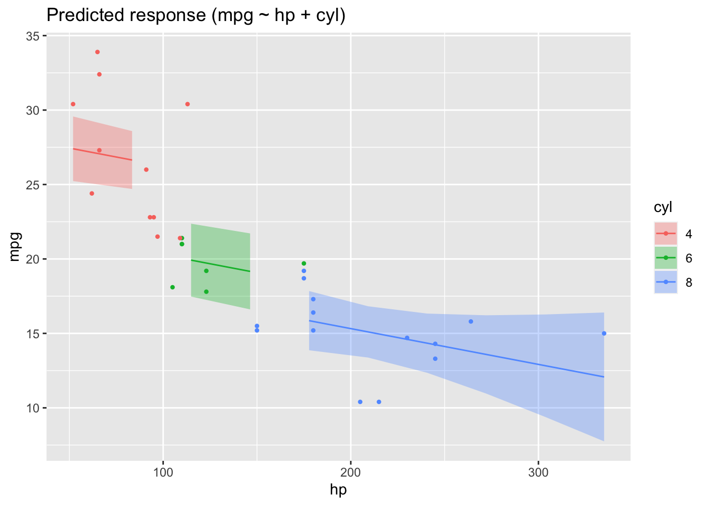

# Modelling and regression

{width="5%"}


## R packages needed for this chapter


::: {.cell}

```{.r .cell-code}
library(easystats)
library(tidyverse)
library(rstanarm)  # optional!
```
:::


## What's modelling?

[Read this great introduction by modelling by Russel Poldrack](https://statsthinking21.github.io/statsthinking21-core-site/fitting-models.html#what-is-a-model). Actually, the whole book is nice @poldrack_statistical_2022.


An epitome of modelling is this, let's call it the fundamental modelling equation, a bit grandiose but at the point, see @eq-modelling.


The data can be separated in the model's prediction and the rest (the "error"), i.e., what's unaccounted for by the model.

$$
\text{data} = \text{model} + \text{error}
$${#eq-modelling}


A more visual account of our basic modelling equation is depicted in @fig-model1.


:::{.cell}

:::{.cell-output-display}

:::{#fig-model1}

<p >

<pre class="mermaid" data-tooltip-selector="#mermaid-tooltip-1">flowchart LR
  X --&gt; Y
  error --&gt; Y
</pre>

<div id="mermaid-tooltip-1" class="mermaidTooltip"></div>
</p>


A more visual account of our basic modelling equation
:::
:::
:::


## Regression as the umbrella tool for modelling

{width="50%"}

Alternatively, venture into the forest of statistical tests as [oultined eg here, at Uni Muenster](https://web.archive.org/web/20091029162244/http://www.wiwi.uni-muenster.de/ioeb/en/organisation/pfaff/stat_overview_table.html).

You may want to ponder on this image of a decision tree of which test to choose, see Figure @fig-choose-test.

{#fig-choose-test}

### Common statistical tests are linear models

As Jonas Kristoffer Lindeløv tells us, we can formulate most statistical tests as a linear model, ie., a regression.


### How to find the regression line

In the simplest case, regression analyses can be interpreted geometrically as a line in a 2D coordinate system, see Figre @fig-regr1.

{#fig-regr1}

Put simple, we are looking for the line which is in the "middle of the points". More precisely, we place the line such that the squared distances from the line to the points is minimal, see Figre @fig-regr1.

Consider Figure @fig-regr2, from [this source](https://bookdown.org/roback/bookdown-BeyondMLR/ch-MLRreview.html#assumptions-for-linear-least-squares-regression) by @roback_beyond_2021. It visualizes not only the notorious regression line, but also sheds light on regression assumptions, particularly on the error distribution.

{#fig-regr2}

### The linear model

Here's the canonical form of the linear model.

Consider a model with $k$ predictors:

$$y = \beta_0 + \beta_1 x_1 + \ldots + \beta_k x_k + \epsilon$$

### Algebraic derivation

For the mathematical inclined, check out [this derivation](https://data-se.netlify.app/2022/05/23/ableitung-der-koeffizienten-der-einfachen-regression/) of the simple case regression model. Note that the article is written in German, but your browser can effortlessly translate into English. Here's a [similar English article from StackExchange](https://math.stackexchange.com/questions/716826/derivation-of-simple-linear-regression-parameters).

## R-packages needed

For this chapter, the following R packages are needed.


::: {.cell}

```{.r .cell-code}
library(rstanarm)
library(tidyverse)
library(easystats)
```
:::


## In all its glory


::: {.cell}
::: {.cell-output-display}
{width=672}
:::
:::


## First model: one metric predictor

First, let's load some data:


::: {.cell}

```{.r .cell-code}
data(mtcars)
glimpse(mtcars)
```

::: {.cell-output .cell-output-stdout}
```
Rows: 32
Columns: 11
$ mpg  <dbl> 21.0, 21.0, 22.8, 21.4, 18.7, 18.1, 14.3, 24.4, 22.8, 19.2, 17.8,…
$ cyl  <dbl> 6, 6, 4, 6, 8, 6, 8, 4, 4, 6, 6, 8, 8, 8, 8, 8, 8, 4, 4, 4, 4, 8,…
$ disp <dbl> 160.0, 160.0, 108.0, 258.0, 360.0, 225.0, 360.0, 146.7, 140.8, 16…
$ hp   <dbl> 110, 110, 93, 110, 175, 105, 245, 62, 95, 123, 123, 180, 180, 180…
$ drat <dbl> 3.90, 3.90, 3.85, 3.08, 3.15, 2.76, 3.21, 3.69, 3.92, 3.92, 3.92,…
$ wt   <dbl> 2.620, 2.875, 2.320, 3.215, 3.440, 3.460, 3.570, 3.190, 3.150, 3.…
$ qsec <dbl> 16.46, 17.02, 18.61, 19.44, 17.02, 20.22, 15.84, 20.00, 22.90, 18…
$ vs   <dbl> 0, 0, 1, 1, 0, 1, 0, 1, 1, 1, 1, 0, 0, 0, 0, 0, 0, 1, 1, 1, 1, 0,…
$ am   <dbl> 1, 1, 1, 0, 0, 0, 0, 0, 0, 0, 0, 0, 0, 0, 0, 0, 0, 1, 1, 1, 0, 0,…
$ gear <dbl> 4, 4, 4, 3, 3, 3, 3, 4, 4, 4, 4, 3, 3, 3, 3, 3, 3, 4, 4, 4, 3, 3,…
$ carb <dbl> 4, 4, 1, 1, 2, 1, 4, 2, 2, 4, 4, 3, 3, 3, 4, 4, 4, 1, 2, 1, 1, 2,…
```
:::
:::


### Frequentist

Define and fit the model:


::: {.cell}

```{.r .cell-code}
lm1_freq <- lm(mpg ~ hp, data = mtcars)
```
:::


Get the parameter values:


::: {.cell}

```{.r .cell-code}
parameters(lm1_freq)
```

::: {.cell-output-display}
<div class="kable-table">

|Parameter   | Coefficient|        SE|   CI|     CI_low|    CI_high|         t| df_error|     p|
|:-----------|-----------:|---------:|----:|----------:|----------:|---------:|--------:|-----:|
|(Intercept) |  30.0988605| 1.6339210| 0.95| 26.7619488| 33.4357723| 18.421246|       30| 0e+00|
|hp          |  -0.0682283| 0.0101193| 0.95| -0.0888947| -0.0475619| -6.742388|       30| 2e-07|

</div>
:::
:::


Plot the model parameters:


::: {.cell}

```{.r .cell-code}
plot(parameters(lm1_freq))
```

::: {.cell-output .cell-output-stderr}
```
Warning: Using `size` aesthetic for lines was deprecated in ggplot2 3.4.0.
Please use `linewidth` instead.
```
:::

::: {.cell-output-display}
{width=672}
:::
:::


### Bayesian


::: {.cell}

```{.r .cell-code}
lm1_bayes <- stan_glm(mpg ~ hp, data = mtcars)
```

::: {.cell-output .cell-output-stdout}
```

SAMPLING FOR MODEL 'continuous' NOW (CHAIN 1).
Chain 1: 
Chain 1: Gradient evaluation took 0.001406 seconds
Chain 1: 1000 transitions using 10 leapfrog steps per transition would take 14.06 seconds.
Chain 1: Adjust your expectations accordingly!
Chain 1: 
Chain 1: 
Chain 1: Iteration:    1 / 2000 [  0%]  (Warmup)
Chain 1: Iteration:  200 / 2000 [ 10%]  (Warmup)
Chain 1: Iteration:  400 / 2000 [ 20%]  (Warmup)
Chain 1: Iteration:  600 / 2000 [ 30%]  (Warmup)
Chain 1: Iteration:  800 / 2000 [ 40%]  (Warmup)
Chain 1: Iteration: 1000 / 2000 [ 50%]  (Warmup)
Chain 1: Iteration: 1001 / 2000 [ 50%]  (Sampling)
Chain 1: Iteration: 1200 / 2000 [ 60%]  (Sampling)
Chain 1: Iteration: 1400 / 2000 [ 70%]  (Sampling)
Chain 1: Iteration: 1600 / 2000 [ 80%]  (Sampling)
Chain 1: Iteration: 1800 / 2000 [ 90%]  (Sampling)
Chain 1: Iteration: 2000 / 2000 [100%]  (Sampling)
Chain 1: 
Chain 1:  Elapsed Time: 0.036347 seconds (Warm-up)
Chain 1:                0.03071 seconds (Sampling)
Chain 1:                0.067057 seconds (Total)
Chain 1: 

SAMPLING FOR MODEL 'continuous' NOW (CHAIN 2).
Chain 2: 
Chain 2: Gradient evaluation took 1.9e-05 seconds
Chain 2: 1000 transitions using 10 leapfrog steps per transition would take 0.19 seconds.
Chain 2: Adjust your expectations accordingly!
Chain 2: 
Chain 2: 
Chain 2: Iteration:    1 / 2000 [  0%]  (Warmup)
Chain 2: Iteration:  200 / 2000 [ 10%]  (Warmup)
Chain 2: Iteration:  400 / 2000 [ 20%]  (Warmup)
Chain 2: Iteration:  600 / 2000 [ 30%]  (Warmup)
Chain 2: Iteration:  800 / 2000 [ 40%]  (Warmup)
Chain 2: Iteration: 1000 / 2000 [ 50%]  (Warmup)
Chain 2: Iteration: 1001 / 2000 [ 50%]  (Sampling)
Chain 2: Iteration: 1200 / 2000 [ 60%]  (Sampling)
Chain 2: Iteration: 1400 / 2000 [ 70%]  (Sampling)
Chain 2: Iteration: 1600 / 2000 [ 80%]  (Sampling)
Chain 2: Iteration: 1800 / 2000 [ 90%]  (Sampling)
Chain 2: Iteration: 2000 / 2000 [100%]  (Sampling)
Chain 2: 
Chain 2:  Elapsed Time: 0.033469 seconds (Warm-up)
Chain 2:                0.035926 seconds (Sampling)
Chain 2:                0.069395 seconds (Total)
Chain 2: 

SAMPLING FOR MODEL 'continuous' NOW (CHAIN 3).
Chain 3: 
Chain 3: Gradient evaluation took 1.3e-05 seconds
Chain 3: 1000 transitions using 10 leapfrog steps per transition would take 0.13 seconds.
Chain 3: Adjust your expectations accordingly!
Chain 3: 
Chain 3: 
Chain 3: Iteration:    1 / 2000 [  0%]  (Warmup)
Chain 3: Iteration:  200 / 2000 [ 10%]  (Warmup)
Chain 3: Iteration:  400 / 2000 [ 20%]  (Warmup)
Chain 3: Iteration:  600 / 2000 [ 30%]  (Warmup)
Chain 3: Iteration:  800 / 2000 [ 40%]  (Warmup)
Chain 3: Iteration: 1000 / 2000 [ 50%]  (Warmup)
Chain 3: Iteration: 1001 / 2000 [ 50%]  (Sampling)
Chain 3: Iteration: 1200 / 2000 [ 60%]  (Sampling)
Chain 3: Iteration: 1400 / 2000 [ 70%]  (Sampling)
Chain 3: Iteration: 1600 / 2000 [ 80%]  (Sampling)
Chain 3: Iteration: 1800 / 2000 [ 90%]  (Sampling)
Chain 3: Iteration: 2000 / 2000 [100%]  (Sampling)
Chain 3: 
Chain 3:  Elapsed Time: 0.035342 seconds (Warm-up)
Chain 3:                0.031618 seconds (Sampling)
Chain 3:                0.06696 seconds (Total)
Chain 3: 

SAMPLING FOR MODEL 'continuous' NOW (CHAIN 4).
Chain 4: 
Chain 4: Gradient evaluation took 1.8e-05 seconds
Chain 4: 1000 transitions using 10 leapfrog steps per transition would take 0.18 seconds.
Chain 4: Adjust your expectations accordingly!
Chain 4: 
Chain 4: 
Chain 4: Iteration:    1 / 2000 [  0%]  (Warmup)
Chain 4: Iteration:  200 / 2000 [ 10%]  (Warmup)
Chain 4: Iteration:  400 / 2000 [ 20%]  (Warmup)
Chain 4: Iteration:  600 / 2000 [ 30%]  (Warmup)
Chain 4: Iteration:  800 / 2000 [ 40%]  (Warmup)
Chain 4: Iteration: 1000 / 2000 [ 50%]  (Warmup)
Chain 4: Iteration: 1001 / 2000 [ 50%]  (Sampling)
Chain 4: Iteration: 1200 / 2000 [ 60%]  (Sampling)
Chain 4: Iteration: 1400 / 2000 [ 70%]  (Sampling)
Chain 4: Iteration: 1600 / 2000 [ 80%]  (Sampling)
Chain 4: Iteration: 1800 / 2000 [ 90%]  (Sampling)
Chain 4: Iteration: 2000 / 2000 [100%]  (Sampling)
Chain 4: 
Chain 4:  Elapsed Time: 0.031239 seconds (Warm-up)
Chain 4:                0.030868 seconds (Sampling)
Chain 4:                0.062107 seconds (Total)
Chain 4: 
```
:::
:::


Actually, we want to suppress some overly verbose output of the sampling, so add the argument `refresh = 0`:


::: {.cell}

```{.r .cell-code}
lm1_bayes <- stan_glm(mpg ~ hp, data = mtcars, refresh = 0)
```
:::


Get the parameter values:


::: {.cell}

```{.r .cell-code}
parameters(lm1_bayes)
```

::: {.cell-output-display}
<div class="kable-table">

|Parameter   |     Median|   CI|     CI_low|    CI_high| pd| ROPE_Percentage|      Rhat|      ESS|Prior_Distribution | Prior_Location| Prior_Scale|
|:-----------|----------:|----:|----------:|----------:|--:|---------------:|---------:|--------:|:------------------|--------------:|-----------:|
|(Intercept) | 30.0553039| 0.95| 26.5874236| 33.5288105|  1|               0| 0.9993612| 3487.218|normal             |       20.09062|  15.0673701|
|hp          | -0.0683969| 0.95| -0.0894888| -0.0466614|  1|               1| 0.9997904| 3513.985|normal             |        0.00000|   0.2197599|

</div>
:::
:::


Plot the model parameters:


::: {.cell}

```{.r .cell-code}
plot(parameters(lm1_bayes))
```

::: {.cell-output-display}
{width=672}
:::
:::


### Model performance


::: {.cell}

```{.r .cell-code}
r2(lm1_freq)
```

::: {.cell-output .cell-output-stdout}
```
# R2 for Linear Regression
       R2: 0.602
  adj. R2: 0.589
```
:::
:::

::: {.cell}

```{.r .cell-code}
r2(lm1_bayes)
```

::: {.cell-output .cell-output-stdout}
```
# Bayesian R2 with Compatibility Interval

  Conditional R2: 0.584 (95% CI [0.379, 0.750])
```
:::
:::


### Model check

Here's a bunch of typical model checks in the Frequentist sense.


::: {.cell fit-width='10' fig.asp='1'}

```{.r .cell-code}
check_model(lm1_freq)
```

::: {.cell-output-display}
{width=100%}
:::
:::


And here are some Bayesian flavored model checks.


::: {.cell fit-width='10' fig.asp='1'}

```{.r .cell-code}
check_model(lm1_bayes)
```

::: {.cell-output-display}
{width=100%}
:::
:::


### Get some predictions


::: {.cell}

```{.r .cell-code}
lm1_pred <- estimate_relation(lm1_freq)
lm1_pred
```

::: {.cell-output-display}
<div class="kable-table">

|        hp| Predicted|        SE|    CI_low|  CI_high|
|---------:|---------:|---------:|---------:|--------:|
|  52.00000| 26.550990| 1.1766139| 24.148024| 28.95396|
|  83.44444| 24.405590| 0.9358933| 22.494241| 26.31694|
| 114.88889| 22.260189| 0.7548971| 20.718484| 23.80190|
| 146.33333| 20.114789| 0.6828911| 18.720139| 21.50944|
| 177.77778| 17.969389| 0.7518697| 16.433866| 19.50491|
| 209.22222| 15.823989| 0.9310065| 13.922620| 17.72536|
| 240.66667| 13.678588| 1.1707841| 11.287528| 16.06965|
| 272.11111| 11.533188| 1.4412478|  8.589767| 14.47661|
| 303.55556|  9.387788| 1.7280486|  5.858642| 12.91693|
| 335.00000|  7.242387| 2.0242544|  3.108308| 11.37647|

</div>
:::
:::


More details on the above function can be found on the [respective page at the easystats site](https://easystats.github.io/modelbased/reference/estimate_expectation.html#functions-for-estimating-predicted-values-and-uncertainty).

### Plot the model


::: {.cell}

```{.r .cell-code}
plot(lm1_pred)
```

::: {.cell-output-display}
{width=672}
:::
:::


## More of this

More technical details for gauging model performance and model quality, can be found on the site of [the R package "performance](https://easystats.github.io/performance/) at the easystats site.

## Bayes-members only

Bayes statistics provide a distribution as the result of the analysis, the posterior distribution, which provides us with quite some luxury.

As the posterior distribution manifests itself by a number of samples, we can easily filter and manipulate this sample distribution in order to ask some interesing questions.

See:


::: {.cell}

```{.r .cell-code}
lm1_bayes %>% 
  as_tibble() %>% 
  head()
```

::: {.cell-output-display}
<div class="kable-table">

| (Intercept)|         hp|    sigma|
|-----------:|----------:|--------:|
|    30.45748| -0.0671151| 4.334861|
|    29.68723| -0.0634855| 3.754180|
|    29.63639| -0.0683420| 3.560405|
|    30.52217| -0.0678723| 3.856826|
|    29.91507| -0.0685724| 3.610405|
|    31.69873| -0.0810027| 3.631821|

</div>
:::
:::


### Asking for probabilites

*What's the probability that the effect of hp is negative?*


::: {.cell}

```{.r .cell-code}
lm1_bayes %>% 
  as_tibble() %>% 
  count(hp < 0)
```

::: {.cell-output-display}
<div class="kable-table">

|hp < 0 |    n|
|:------|----:|
|TRUE   | 4000|

</div>
:::
:::


Feel free to ask similar questions!

### Asking for quantiles

*With a given probability of, say 90%, how large is the effect of hp?*


::: {.cell}

```{.r .cell-code}
lm1_bayes %>% 
  as_tibble() %>% 
  summarise(q_90 = quantile(hp, .9))
```

::: {.cell-output-display}
<div class="kable-table">

|       q_90|
|----------:|
| -0.0545755|

</div>
:::
:::


*What's the smallest 95% percent interval for the effect of hp?*


::: {.cell}

```{.r .cell-code}
hdi(lm1_bayes)
```

::: {.cell-output-display}
<div class="kable-table">

|Parameter   |   CI|     CI_low|    CI_high|Effects |Component   |
|:-----------|----:|----------:|----------:|:-------|:-----------|
|(Intercept) | 0.95| 26.5876438| 33.5355645|fixed   |conditional |
|hp          | 0.95| -0.0882026| -0.0456057|fixed   |conditional |

</div>
:::
:::


In case you prefer 89% intervals (I do!):


::: {.cell}

```{.r .cell-code}
hdi(lm1_bayes, ci = .89)
```

::: {.cell-output-display}
<div class="kable-table">

|Parameter   |   CI|    CI_low|    CI_high|Effects |Component   |
|:-----------|----:|---------:|----------:|:-------|:-----------|
|(Intercept) | 0.89| 27.361972| 32.9444275|fixed   |conditional |
|hp          | 0.89| -0.084607| -0.0506713|fixed   |conditional |

</div>
:::
:::


## Multiple metric predictors

Assume we have a theory that dictates that fuel economy is a (causal) function of horse power and engine displacement.


::: {.cell}

```{.r .cell-code}
lm2_freq <- lm(mpg ~ hp + disp, data = mtcars)
parameters(lm2_freq)
```

::: {.cell-output-display}
<div class="kable-table">

|Parameter   | Coefficient|        SE|   CI|     CI_low|    CI_high|         t| df_error|         p|
|:-----------|-----------:|---------:|----:|----------:|----------:|---------:|--------:|---------:|
|(Intercept) |  30.7359042| 1.3315661| 0.95| 28.0125457| 33.4592628| 23.082522|       29| 0.0000000|
|hp          |  -0.0248401| 0.0133855| 0.95| -0.0522165|  0.0025363| -1.855746|       29| 0.0736791|
|disp        |  -0.0303463| 0.0074049| 0.95| -0.0454909| -0.0152016| -4.098159|       29| 0.0003063|

</div>
:::
:::


Similarly for Bayes inference:


::: {.cell}

```{.r .cell-code}
lm2_bayes <- stan_glm(mpg ~ hp + disp, data = mtcars)
```
:::


Results


::: {.cell}

```{.r .cell-code}
parameters(lm2_bayes)
```

::: {.cell-output-display}
<div class="kable-table">

|Parameter   |     Median|   CI|     CI_low|    CI_high|     pd| ROPE_Percentage|     Rhat|      ESS|Prior_Distribution | Prior_Location| Prior_Scale|
|:-----------|----------:|----:|----------:|----------:|------:|---------------:|--------:|--------:|:------------------|--------------:|-----------:|
|(Intercept) | 30.7391469| 0.95| 28.0125768| 33.5190791| 1.0000|               0| 1.000132| 4229.243|normal             |       20.09062|  15.0673701|
|hp          | -0.0252385| 0.95| -0.0540080|  0.0040053| 0.9555|               1| 1.000813| 1551.503|normal             |        0.00000|   0.2197599|
|disp        | -0.0300650| 0.95| -0.0467173| -0.0142290| 1.0000|               1| 1.000353| 1646.682|normal             |        0.00000|   0.1215712|

</div>
:::

```{.r .cell-code}
plot(parameters(lm2_bayes))
```

::: {.cell-output-display}
{width=672}
:::

```{.r .cell-code}
r2(lm2_bayes)
```

::: {.cell-output .cell-output-stdout}
```
# Bayesian R2 with Compatibility Interval

  Conditional R2: 0.728 (95% CI [0.578, 0.844])
```
:::
:::


Depending on the value of `disp` the prediction of `mpg` from `hp` will vary:


::: {.cell}

```{.r .cell-code}
lm2_pred <- estimate_relation(lm2_freq)
plot(lm2_pred)
```

::: {.cell-output-display}
{width=672}
:::
:::


## One nominal predictor


::: {.cell}

```{.r .cell-code}
mtcars2 <-
  mtcars %>% 
  mutate(am_f = factor(am))

lm3a <- lm(mpg ~ am_f, data = mtcars2)
parameters(lm3a)
```

::: {.cell-output-display}
<div class="kable-table">

|Parameter   | Coefficient|       SE|   CI|   CI_low|  CI_high|         t| df_error|        p|
|:-----------|-----------:|--------:|----:|--------:|--------:|---------:|--------:|--------:|
|(Intercept) |   17.147368| 1.124602| 0.95| 14.85062| 19.44411| 15.247492|       30| 0.000000|
|am_f1       |    7.244939| 1.764422| 0.95|  3.64151| 10.84837|  4.106127|       30| 0.000285|

</div>
:::
:::

::: {.cell}

```{.r .cell-code}
lm3a_means <- estimate_means(lm3a, at = "am_f")
lm3a_means 
```

::: {.cell-output-display}
<div class="kable-table">

|am_f |     Mean|       SE|   CI_low|  CI_high|
|:----|--------:|--------:|--------:|--------:|
|0    | 17.14737| 1.124602| 14.85062| 19.44411|
|1    | 24.39231| 1.359578| 21.61568| 27.16894|

</div>
:::
:::

::: {.cell}

```{.r .cell-code}
plot(lm3a_means)
```

::: {.cell-output-display}
{width=672}
:::
:::


Note that we should have converted `am` to a factor variable before fitting the model. Otherwise, the plot won't work.

Here's a more hand-crafted version of the last plot, see Fig. @fig-lm3a-means.


::: {.cell}

```{.r .cell-code}
ggplot(mtcars2) +
  aes(x = am_f, y = mpg) +
  geom_violin() +
  geom_jitter(width = .1, alpha = .5) +
  geom_pointrange(data = lm3a_means,
                  color = "orange",
                  aes(ymin = CI_low, ymax = CI_high, y = Mean)) +
  geom_line(data = lm3a_means, aes(y = Mean, group = 1))
```

::: {.cell-output-display}
{#fig-lm3a-means width=672}
:::
:::


## One metric and one nominal predictor


::: {.cell}

```{.r .cell-code}
mtcars2 <-
  mtcars %>% 
  mutate(cyl = factor(cyl))

lm4 <- lm(mpg ~ hp + cyl, data = mtcars2)
parameters(lm4)
```

::: {.cell-output-display}
<div class="kable-table">

|Parameter   | Coefficient|        SE|   CI|      CI_low|    CI_high|         t| df_error|         p|
|:-----------|-----------:|---------:|----:|-----------:|----------:|---------:|--------:|---------:|
|(Intercept) |  28.6501182| 1.5877870| 0.95|  25.3976840| 31.9025524| 18.044056|       28| 0.0000000|
|hp          |  -0.0240388| 0.0154079| 0.95|  -0.0556005|  0.0075228| -1.560163|       28| 0.1299540|
|cyl6        |  -5.9676551| 1.6392776| 0.95|  -9.3255631| -2.6097471| -3.640418|       28| 0.0010921|
|cyl8        |  -8.5208508| 2.3260749| 0.95| -13.2855993| -3.7561022| -3.663188|       28| 0.0010286|

</div>
:::
:::

::: {.cell}

```{.r .cell-code}
lm4_pred <- estimate_relation(lm4)
plot(lm4_pred)
```

::: {.cell-output-display}
{width=672}
:::
:::


## What about correlation?

Correlation is really a close cousin to regression. In fact, regression with standardized variables amounts to correlation.

Let's get the correlation matrix of the variables in involved in `lm4`.


::: {.cell}

```{.r .cell-code}
lm4_corr <- 
  mtcars %>% 
  select(mpg, hp, disp) %>% 
  correlation()

lm4_corr
```

::: {.cell-output-display}
<div class="kable-table">

|Parameter1 |Parameter2 |          r|   CI|     CI_low|    CI_high|         t| df_error|     p|Method              | n_Obs|
|:----------|:----------|----------:|----:|----------:|----------:|---------:|--------:|-----:|:-------------------|-----:|
|mpg        |hp         | -0.7761684| 0.95| -0.8852686| -0.5860994| -6.742388|       30| 2e-07|Pearson correlation |    32|
|mpg        |disp       | -0.8475514| 0.95| -0.9233594| -0.7081376| -8.747151|       30| 0e+00|Pearson correlation |    32|
|hp         |disp       |  0.7909486| 0.95|  0.6106794|  0.8932775|  7.080122|       30| 1e-07|Pearson correlation |    32|

</div>
:::
:::

::: {.cell}

```{.r .cell-code}
plot(summary(lm4_corr))
```

::: {.cell-output-display}
{width=672}
:::
:::


## Exercises

1.  [mtcars simple 1](https://datenwerk.netlify.app/posts/mtcars-simple1/mtcars-simple1/)
2.  [mtcars simple 2](https://datenwerk.netlify.app/posts/mtcars-simple2/mtcars-simple2/)
3.  [mtcars simple 3](https://datenwerk.netlify.app/posts/mtcars-simple3/mtcars-simple3/)

## Lab

Get your own data, and build a simple model reflecting your research hypothesis. If you are lacking data (or hypothesis) get something close to it.

## Literature

An accessible treatment of regression is provided by @ismay_statistical_2020.

@roback_beyond_2021 provide a more than introductory account of regression while being accessible. A recent but already classic book (if this is possible) is the book by @gelman_regression_2021.
You may also benefit from @poldrack_statistical_2022 (open access).

## Debrief


