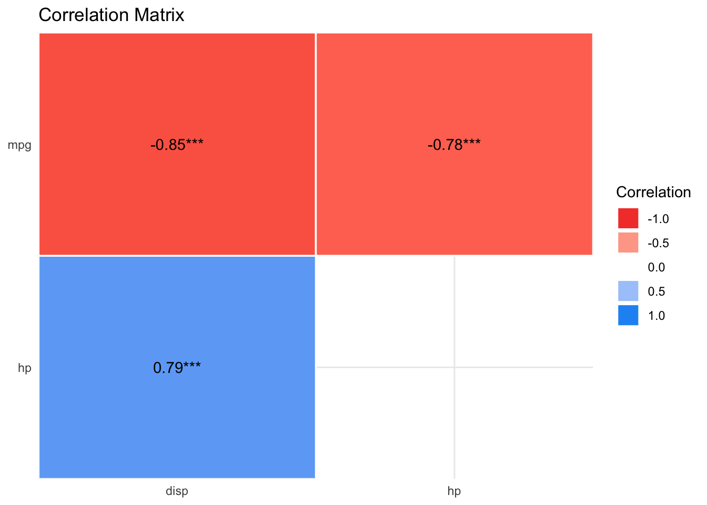

# Regression basics


## Regression as the umbrella tool

{width="50%"}


Alternatively, 
venture into the forest of statistical tests as [oultined eg here, at Uni Muenster](https://web.archive.org/web/20091029162244/http://www.wiwi.uni-muenster.de/ioeb/en/organisation/pfaff/stat_overview_table.html).


You may want to ponder on this image of a decision tree of which test to choose, see Figure @fig-choose-test.

{#fig-choose-test}


## Common statistical tests are linear models


As Jonas Kristoffer Lindeløv tells us,
we can formulate most statistical tests as a linear model, ie., a regression.


## R-packages needed


::: {.cell}

```{.r .cell-code}
library(rstanarm)
library(tidyverse)
library(easystats)
```
:::


## In all its glory


::: {.cell}
::: {.cell-output-display}
{width=672}
:::
:::


## First model: one metric predictor

First, let's load some data:


::: {.cell}

```{.r .cell-code}
data(mtcars)
glimpse(mtcars)
```

::: {.cell-output .cell-output-stdout}
```
Rows: 32
Columns: 11
$ mpg  <dbl> 21.0, 21.0, 22.8, 21.4, 18.7, 18.1, 14.3, 24.4, 22.8, 19.2, 17.8,…
$ cyl  <dbl> 6, 6, 4, 6, 8, 6, 8, 4, 4, 6, 6, 8, 8, 8, 8, 8, 8, 4, 4, 4, 4, 8,…
$ disp <dbl> 160.0, 160.0, 108.0, 258.0, 360.0, 225.0, 360.0, 146.7, 140.8, 16…
$ hp   <dbl> 110, 110, 93, 110, 175, 105, 245, 62, 95, 123, 123, 180, 180, 180…
$ drat <dbl> 3.90, 3.90, 3.85, 3.08, 3.15, 2.76, 3.21, 3.69, 3.92, 3.92, 3.92,…
$ wt   <dbl> 2.620, 2.875, 2.320, 3.215, 3.440, 3.460, 3.570, 3.190, 3.150, 3.…
$ qsec <dbl> 16.46, 17.02, 18.61, 19.44, 17.02, 20.22, 15.84, 20.00, 22.90, 18…
$ vs   <dbl> 0, 0, 1, 1, 0, 1, 0, 1, 1, 1, 1, 0, 0, 0, 0, 0, 0, 1, 1, 1, 1, 0,…
$ am   <dbl> 1, 1, 1, 0, 0, 0, 0, 0, 0, 0, 0, 0, 0, 0, 0, 0, 0, 1, 1, 1, 0, 0,…
$ gear <dbl> 4, 4, 4, 3, 3, 3, 3, 4, 4, 4, 4, 3, 3, 3, 3, 3, 3, 4, 4, 4, 3, 3,…
$ carb <dbl> 4, 4, 1, 1, 2, 1, 4, 2, 2, 4, 4, 3, 3, 3, 4, 4, 4, 1, 2, 1, 1, 2,…
```
:::
:::


### Frequentist

Define and fit the model:


::: {.cell}

```{.r .cell-code}
lm1_freq <- lm(mpg ~ hp, data = mtcars)
```
:::


Get the parameter values:


::: {.cell}

```{.r .cell-code}
parameters(lm1_freq)
```

::: {.cell-output .cell-output-stdout}
```
Parameter   | Coefficient |   SE |         95% CI | t(30) |      p
------------------------------------------------------------------
(Intercept) |       30.10 | 1.63 | [26.76, 33.44] | 18.42 | < .001
hp          |       -0.07 | 0.01 | [-0.09, -0.05] | -6.74 | < .001
```
:::

::: {.cell-output .cell-output-stderr}
```

Uncertainty intervals (equal-tailed) and p-values (two-tailed) computed
  using a Wald t-distribution approximation.
```
:::
:::


Plot the model parameters:


::: {.cell}

```{.r .cell-code}
plot(parameters(lm1_freq))
```

::: {.cell-output-display}
{width=672}
:::
:::


### Bayesian


::: {.cell}

```{.r .cell-code}
lm1_bayes <- stan_glm(mpg ~ hp, data = mtcars, refresh = 0)
```
:::


Actually, we want to suppress some overly verbose output, using `refresh = 0`:

::: {.cell}

```{.r .cell-code}
lm1_bayes <- stan_glm(mpg ~ hp, data = mtcars, refresh = 0)
```
:::


Get the parameter values:


::: {.cell}

```{.r .cell-code}
parameters(lm1_bayes)
```

::: {.cell-output .cell-output-stdout}
```
Parameter   | Median |         95% CI |   pd | % in ROPE |  Rhat |     ESS |                   Prior
----------------------------------------------------------------------------------------------------
(Intercept) |  30.03 | [26.94, 33.35] | 100% |        0% | 1.000 | 3696.00 | Normal (20.09 +- 15.07)
hp          |  -0.07 | [-0.09, -0.05] | 100% |      100% | 0.999 | 3527.00 |   Normal (0.00 +- 0.22)
```
:::

::: {.cell-output .cell-output-stderr}
```

Uncertainty intervals (equal-tailed) and p-values (two-tailed) computed
  using a MCMC distribution approximation.
```
:::
:::


Plot the model parameters:


::: {.cell}

```{.r .cell-code}
plot(parameters(lm1_bayes))
```

::: {.cell-output-display}
{width=672}
:::
:::


## Model performance


::: {.cell}

```{.r .cell-code}
r2(lm1_freq)
```

::: {.cell-output .cell-output-stdout}
```
# R2 for Linear Regression
       R2: 0.602
  adj. R2: 0.589
```
:::
:::

::: {.cell}

```{.r .cell-code}
r2(lm1_bayes)
```

::: {.cell-output .cell-output-stdout}
```
# Bayesian R2 with Compatibility Interval

  Conditional R2: 0.586 (95% CI [0.377, 0.739])
```
:::
:::


## Model check


::: {.cell fit-width='10'}

```{.r .cell-code}
check_model(lm1_freq)
```

::: {.cell-output-display}
{width=100%}
:::
:::

::: {.cell}

```{.r .cell-code}
check_model(lm1_bayes)
```

::: {.cell-output-display}
{width=672}
:::
:::


## More of this

More technical details for gauging model performance and model quality,
can be found on the site of [the R package "performance](https://easystats.github.io/performance/).


## Multiple metric predictors

Assume we have a theory that dictates that fuel economy is a (causal) function of horse power and engine displacement.


::: {.cell}

```{.r .cell-code}
lm2_freq <- lm(mpg ~ hp + disp, data = mtcars)
parameters(lm2_freq)
```

::: {.cell-output .cell-output-stdout}
```
Parameter   | Coefficient |       SE |         95% CI | t(29) |      p
----------------------------------------------------------------------
(Intercept) |       30.74 |     1.33 | [28.01, 33.46] | 23.08 | < .001
hp          |       -0.02 |     0.01 | [-0.05,  0.00] | -1.86 | 0.074 
disp        |       -0.03 | 7.40e-03 | [-0.05, -0.02] | -4.10 | < .001
```
:::

::: {.cell-output .cell-output-stderr}
```

Uncertainty intervals (equal-tailed) and p-values (two-tailed) computed
  using a Wald t-distribution approximation.
```
:::
:::


Similarly for Bayes inference:


::: {.cell}

```{.r .cell-code}
lm2_bayes <- stan_glm(mpg ~ hp + disp, data = mtcars)
```
:::


Results

::: {.cell}

```{.r .cell-code}
parameters(lm2_bayes)
```

::: {.cell-output .cell-output-stdout}
```
Parameter   | Median |         95% CI |     pd | % in ROPE |  Rhat |     ESS |                   Prior
------------------------------------------------------------------------------------------------------
(Intercept) |  30.71 | [27.93, 33.49] |   100% |        0% | 1.000 | 4751.00 | Normal (20.09 +- 15.07)
hp          |  -0.02 | [-0.05,  0.00] | 96.55% |      100% | 1.001 | 1918.00 |   Normal (0.00 +- 0.22)
disp        |  -0.03 | [-0.05, -0.01] |   100% |      100% | 1.001 | 1944.00 |   Normal (0.00 +- 0.12)
```
:::

::: {.cell-output .cell-output-stderr}
```

Uncertainty intervals (equal-tailed) and p-values (two-tailed) computed
  using a MCMC distribution approximation.
```
:::

```{.r .cell-code}
plot(parameters(lm2_bayes))
```

::: {.cell-output-display}
{width=672}
:::

```{.r .cell-code}
r2(lm2_bayes)
```

::: {.cell-output .cell-output-stdout}
```
# Bayesian R2 with Compatibility Interval

  Conditional R2: 0.729 (95% CI [0.571, 0.842])
```
:::
:::


## One nominal predictor


::: {.cell}

```{.r .cell-code}
lm3a <- lm(mpg ~ factor(am), data = mtcars)
parameters(lm3a)
```

::: {.cell-output .cell-output-stdout}
```
Parameter   | Coefficient |   SE |         95% CI | t(30) |      p
------------------------------------------------------------------
(Intercept) |       17.15 | 1.12 | [14.85, 19.44] | 15.25 | < .001
am [1]      |        7.24 | 1.76 | [ 3.64, 10.85] |  4.11 | < .001
```
:::

::: {.cell-output .cell-output-stderr}
```

Uncertainty intervals (equal-tailed) and p-values (two-tailed) computed
  using a Wald t-distribution approximation.
```
:::
:::

::: {.cell}

```{.r .cell-code}
lm3a_means <- estimate_means(lm3a, at = "am")
lm3a_means 
```

::: {.cell-output .cell-output-stdout}
```
Estimated Marginal Means

am   |  Mean |   SE |         95% CI
------------------------------------
0.00 | 17.15 | 1.12 | [14.85, 19.44]
1.00 | 24.39 | 1.36 | [21.62, 27.17]

Marginal means estimated at am
```
:::
:::

::: {.cell}

```{.r .cell-code}
ggplot(mtcars) +
  aes(x = factor(am), y = mpg) +
  geom_violin() +
  geom_jitter(width = .1, alpha = .5) +
  geom_pointrange(data = lm3a_means,
                  color = "orange",
                  aes(ymin = CI_low, ymax = CI_high, y = Mean)) +
  geom_line(data = lm3a_means, aes(y = Mean, group = 1))
```

::: {.cell-output-display}
{width=672}
:::
:::


## One metric and one nominal predictor


::: {.cell}

```{.r .cell-code}
lm4 <- lm(mpg ~ hp + factor(cyl), data = mtcars)
parameters(lm4)
```

::: {.cell-output .cell-output-stdout}
```
Parameter   | Coefficient |   SE |          95% CI | t(28) |      p
-------------------------------------------------------------------
(Intercept) |       28.65 | 1.59 | [ 25.40, 31.90] | 18.04 | < .001
hp          |       -0.02 | 0.02 | [ -0.06,  0.01] | -1.56 | 0.130 
cyl [6]     |       -5.97 | 1.64 | [ -9.33, -2.61] | -3.64 | 0.001 
cyl [8]     |       -8.52 | 2.33 | [-13.29, -3.76] | -3.66 | 0.001 
```
:::

::: {.cell-output .cell-output-stderr}
```

Uncertainty intervals (equal-tailed) and p-values (two-tailed) computed
  using a Wald t-distribution approximation.
```
:::
:::


## Exercises

1. [mtcars simple 1](https://datenwerk.netlify.app/post/mtcars-simple1/mtcars-simple1/)
1. [mtcars simple 2](https://datenwerk.netlify.app/post/mtcars-simple2/mtcars-simple2/)
1. [mtcars simple 3](https://datenwerk.netlify.app/post/mtcars-simple3/mtcars-simple3/)


## Lab

Get your own data, and build a simple model reflecting your research hypothesis. If you are lacking data (or hypothesis) get something close to it.


