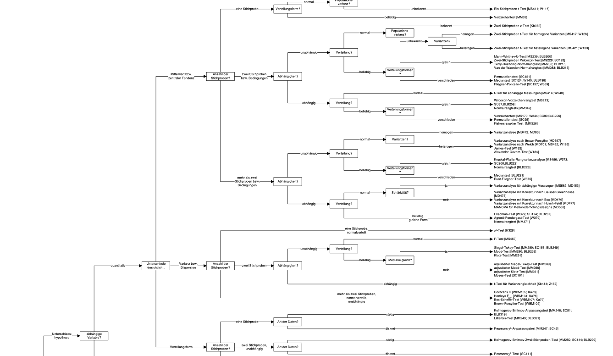

# Modelling and regression

{width="5%"}

## What's modelling?

[Read this great introduction by modelling by Russel Poldrack](https://statsthinking21.github.io/statsthinking21-core-site/fitting-models.html#what-is-a-model). Actually, the whole book is nice @poldrack_statistical_2022.

## Regression as the umbrella tool for modelling

{width="50%"}

Alternatively, venture into the forest of statistical tests as [oultined eg here, at Uni Muenster](https://web.archive.org/web/20091029162244/http://www.wiwi.uni-muenster.de/ioeb/en/organisation/pfaff/stat_overview_table.html).

You may want to ponder on this image of a decision tree of which test to choose, see Figure @fig-choose-test.

{#fig-choose-test}

### Common statistical tests are linear models

As Jonas Kristoffer Lindeløv tells us, we can formulate most statistical tests as a linear model, ie., a regression.


### How to find the regression line

In the simplest case, regression analyses can be interpreted geometrically as a line in a 2D coordinate system, see Figre @fig-regr1.

{#fig-regr1}

Put simple, we are looking for the line which is in the "middle of the points". More precisely, we place the line such that the squared distances from the line to the points is minimal, see Figre @fig-regr1.

Consider Figure @fig-regr2, from [this source](https://bookdown.org/roback/bookdown-BeyondMLR/ch-MLRreview.html#assumptions-for-linear-least-squares-regression) by @roback_beyond_2021. It visualizes not only the notorious regression line, but also sheds light on regression assumptions, particularly on the error distribution.

{#fig-regr2}

### The linear model

Here's the canonical form of the linear model.

Consider a model with $k$ predictors:

$$y = \beta_0 + \beta_1 x_1 + \ldots + \beta_k x_k + \epsilon$$

### Algebraic derivation

For the mathematical inclined, check out [this derivation](https://data-se.netlify.app/2022/05/23/ableitung-der-koeffizienten-der-einfachen-regression/) of the simple case regression model. Note that the article is written in German, but your browser can effortlessly translate into English. Here's a [similar English article from StackExchange](https://math.stackexchange.com/questions/716826/derivation-of-simple-linear-regression-parameters).

## R-packages needed

For this chapter, the following R packages are needed.


::: {.cell}

```{.r .cell-code}
library(rstanarm)
```

::: {.cell-output .cell-output-stderr}
```
Warning: The `size` argument of `element_line()` is deprecated as of ggplot2 3.4.0.
Please use the `linewidth` argument instead.
```
:::

```{.r .cell-code}
library(tidyverse)
library(easystats)
```
:::


## In all its glory


::: {.cell}
::: {.cell-output-display}
{width=672}
:::
:::


## First model: one metric predictor

First, let's load some data:


::: {.cell}

```{.r .cell-code}
data(mtcars)
glimpse(mtcars)
```

::: {.cell-output .cell-output-stdout}
```
Rows: 32
Columns: 11
$ mpg  <dbl> 21.0, 21.0, 22.8, 21.4, 18.7, 18.1, 14.3, 24.4, 22.8, 19.2, 17.8,…
$ cyl  <dbl> 6, 6, 4, 6, 8, 6, 8, 4, 4, 6, 6, 8, 8, 8, 8, 8, 8, 4, 4, 4, 4, 8,…
$ disp <dbl> 160.0, 160.0, 108.0, 258.0, 360.0, 225.0, 360.0, 146.7, 140.8, 16…
$ hp   <dbl> 110, 110, 93, 110, 175, 105, 245, 62, 95, 123, 123, 180, 180, 180…
$ drat <dbl> 3.90, 3.90, 3.85, 3.08, 3.15, 2.76, 3.21, 3.69, 3.92, 3.92, 3.92,…
$ wt   <dbl> 2.620, 2.875, 2.320, 3.215, 3.440, 3.460, 3.570, 3.190, 3.150, 3.…
$ qsec <dbl> 16.46, 17.02, 18.61, 19.44, 17.02, 20.22, 15.84, 20.00, 22.90, 18…
$ vs   <dbl> 0, 0, 1, 1, 0, 1, 0, 1, 1, 1, 1, 0, 0, 0, 0, 0, 0, 1, 1, 1, 1, 0,…
$ am   <dbl> 1, 1, 1, 0, 0, 0, 0, 0, 0, 0, 0, 0, 0, 0, 0, 0, 0, 1, 1, 1, 0, 0,…
$ gear <dbl> 4, 4, 4, 3, 3, 3, 3, 4, 4, 4, 4, 3, 3, 3, 3, 3, 3, 4, 4, 4, 3, 3,…
$ carb <dbl> 4, 4, 1, 1, 2, 1, 4, 2, 2, 4, 4, 3, 3, 3, 4, 4, 4, 1, 2, 1, 1, 2,…
```
:::
:::


### Frequentist

Define and fit the model:


::: {.cell}

```{.r .cell-code}
lm1_freq <- lm(mpg ~ hp, data = mtcars)
```
:::


Get the parameter values:


::: {.cell}

```{.r .cell-code}
parameters(lm1_freq)
```

::: {.cell-output .cell-output-stdout}
```
Parameter   | Coefficient |   SE |         95% CI | t(30) |      p
------------------------------------------------------------------
(Intercept) |       30.10 | 1.63 | [26.76, 33.44] | 18.42 | < .001
hp          |       -0.07 | 0.01 | [-0.09, -0.05] | -6.74 | < .001
```
:::

::: {.cell-output .cell-output-stderr}
```

Uncertainty intervals (equal-tailed) and p-values (two-tailed) computed
  using a Wald t-distribution approximation.
```
:::
:::


Plot the model parameters:


::: {.cell}

```{.r .cell-code}
plot(parameters(lm1_freq))
```

::: {.cell-output .cell-output-stderr}
```
Warning: Using `size` aesthetic for lines was deprecated in ggplot2 3.4.0.
Please use `linewidth` instead.
```
:::

::: {.cell-output-display}
{width=672}
:::
:::


### Bayesian


::: {.cell}

```{.r .cell-code}
lm1_bayes <- stan_glm(mpg ~ hp, data = mtcars)
```

::: {.cell-output .cell-output-stdout}
```

SAMPLING FOR MODEL 'continuous' NOW (CHAIN 1).
Chain 1: 
Chain 1: Gradient evaluation took 0.000601 seconds
Chain 1: 1000 transitions using 10 leapfrog steps per transition would take 6.01 seconds.
Chain 1: Adjust your expectations accordingly!
Chain 1: 
Chain 1: 
Chain 1: Iteration:    1 / 2000 [  0%]  (Warmup)
Chain 1: Iteration:  200 / 2000 [ 10%]  (Warmup)
Chain 1: Iteration:  400 / 2000 [ 20%]  (Warmup)
Chain 1: Iteration:  600 / 2000 [ 30%]  (Warmup)
Chain 1: Iteration:  800 / 2000 [ 40%]  (Warmup)
Chain 1: Iteration: 1000 / 2000 [ 50%]  (Warmup)
Chain 1: Iteration: 1001 / 2000 [ 50%]  (Sampling)
Chain 1: Iteration: 1200 / 2000 [ 60%]  (Sampling)
Chain 1: Iteration: 1400 / 2000 [ 70%]  (Sampling)
Chain 1: Iteration: 1600 / 2000 [ 80%]  (Sampling)
Chain 1: Iteration: 1800 / 2000 [ 90%]  (Sampling)
Chain 1: Iteration: 2000 / 2000 [100%]  (Sampling)
Chain 1: 
Chain 1:  Elapsed Time: 0.046955 seconds (Warm-up)
Chain 1:                0.046687 seconds (Sampling)
Chain 1:                0.093642 seconds (Total)
Chain 1: 

SAMPLING FOR MODEL 'continuous' NOW (CHAIN 2).
Chain 2: 
Chain 2: Gradient evaluation took 2e-05 seconds
Chain 2: 1000 transitions using 10 leapfrog steps per transition would take 0.2 seconds.
Chain 2: Adjust your expectations accordingly!
Chain 2: 
Chain 2: 
Chain 2: Iteration:    1 / 2000 [  0%]  (Warmup)
Chain 2: Iteration:  200 / 2000 [ 10%]  (Warmup)
Chain 2: Iteration:  400 / 2000 [ 20%]  (Warmup)
Chain 2: Iteration:  600 / 2000 [ 30%]  (Warmup)
Chain 2: Iteration:  800 / 2000 [ 40%]  (Warmup)
Chain 2: Iteration: 1000 / 2000 [ 50%]  (Warmup)
Chain 2: Iteration: 1001 / 2000 [ 50%]  (Sampling)
Chain 2: Iteration: 1200 / 2000 [ 60%]  (Sampling)
Chain 2: Iteration: 1400 / 2000 [ 70%]  (Sampling)
Chain 2: Iteration: 1600 / 2000 [ 80%]  (Sampling)
Chain 2: Iteration: 1800 / 2000 [ 90%]  (Sampling)
Chain 2: Iteration: 2000 / 2000 [100%]  (Sampling)
Chain 2: 
Chain 2:  Elapsed Time: 0.050986 seconds (Warm-up)
Chain 2:                0.048418 seconds (Sampling)
Chain 2:                0.099404 seconds (Total)
Chain 2: 

SAMPLING FOR MODEL 'continuous' NOW (CHAIN 3).
Chain 3: 
Chain 3: Gradient evaluation took 1.9e-05 seconds
Chain 3: 1000 transitions using 10 leapfrog steps per transition would take 0.19 seconds.
Chain 3: Adjust your expectations accordingly!
Chain 3: 
Chain 3: 
Chain 3: Iteration:    1 / 2000 [  0%]  (Warmup)
Chain 3: Iteration:  200 / 2000 [ 10%]  (Warmup)
Chain 3: Iteration:  400 / 2000 [ 20%]  (Warmup)
Chain 3: Iteration:  600 / 2000 [ 30%]  (Warmup)
Chain 3: Iteration:  800 / 2000 [ 40%]  (Warmup)
Chain 3: Iteration: 1000 / 2000 [ 50%]  (Warmup)
Chain 3: Iteration: 1001 / 2000 [ 50%]  (Sampling)
Chain 3: Iteration: 1200 / 2000 [ 60%]  (Sampling)
Chain 3: Iteration: 1400 / 2000 [ 70%]  (Sampling)
Chain 3: Iteration: 1600 / 2000 [ 80%]  (Sampling)
Chain 3: Iteration: 1800 / 2000 [ 90%]  (Sampling)
Chain 3: Iteration: 2000 / 2000 [100%]  (Sampling)
Chain 3: 
Chain 3:  Elapsed Time: 0.050064 seconds (Warm-up)
Chain 3:                0.052421 seconds (Sampling)
Chain 3:                0.102485 seconds (Total)
Chain 3: 

SAMPLING FOR MODEL 'continuous' NOW (CHAIN 4).
Chain 4: 
Chain 4: Gradient evaluation took 1.8e-05 seconds
Chain 4: 1000 transitions using 10 leapfrog steps per transition would take 0.18 seconds.
Chain 4: Adjust your expectations accordingly!
Chain 4: 
Chain 4: 
Chain 4: Iteration:    1 / 2000 [  0%]  (Warmup)
Chain 4: Iteration:  200 / 2000 [ 10%]  (Warmup)
Chain 4: Iteration:  400 / 2000 [ 20%]  (Warmup)
Chain 4: Iteration:  600 / 2000 [ 30%]  (Warmup)
Chain 4: Iteration:  800 / 2000 [ 40%]  (Warmup)
Chain 4: Iteration: 1000 / 2000 [ 50%]  (Warmup)
Chain 4: Iteration: 1001 / 2000 [ 50%]  (Sampling)
Chain 4: Iteration: 1200 / 2000 [ 60%]  (Sampling)
Chain 4: Iteration: 1400 / 2000 [ 70%]  (Sampling)
Chain 4: Iteration: 1600 / 2000 [ 80%]  (Sampling)
Chain 4: Iteration: 1800 / 2000 [ 90%]  (Sampling)
Chain 4: Iteration: 2000 / 2000 [100%]  (Sampling)
Chain 4: 
Chain 4:  Elapsed Time: 0.05014 seconds (Warm-up)
Chain 4:                0.046328 seconds (Sampling)
Chain 4:                0.096468 seconds (Total)
Chain 4: 
```
:::
:::


Actually, we want to suppress some overly verbose output, using `refresh = 0`:


::: {.cell}

```{.r .cell-code}
lm1_bayes <- stan_glm(mpg ~ hp, data = mtcars, refresh = 0)
```
:::


Get the parameter values:


::: {.cell}

```{.r .cell-code}
parameters(lm1_bayes)
```

::: {.cell-output .cell-output-stdout}
```
Parameter   | Median |         95% CI |   pd | % in ROPE |  Rhat |     ESS |                   Prior
----------------------------------------------------------------------------------------------------
(Intercept) |  30.04 | [26.90, 33.42] | 100% |        0% | 1.001 | 3055.00 | Normal (20.09 +- 15.07)
hp          |  -0.07 | [-0.09, -0.05] | 100% |      100% | 1.001 | 3100.00 |   Normal (0.00 +- 0.22)
```
:::

::: {.cell-output .cell-output-stderr}
```

Uncertainty intervals (equal-tailed) and p-values (two-tailed) computed
  using a MCMC distribution approximation.
```
:::
:::


Plot the model parameters:


::: {.cell}

```{.r .cell-code}
plot(parameters(lm1_bayes))
```

::: {.cell-output-display}
{width=672}
:::
:::


### Model performance


::: {.cell}

```{.r .cell-code}
r2(lm1_freq)
```

::: {.cell-output .cell-output-stdout}
```
# R2 for Linear Regression
       R2: 0.602
  adj. R2: 0.589
```
:::
:::

::: {.cell}

```{.r .cell-code}
r2(lm1_bayes)
```

::: {.cell-output .cell-output-stdout}
```
# Bayesian R2 with Compatibility Interval

  Conditional R2: 0.586 (95% CI [0.389, 0.757])
```
:::
:::


### Model check


::: {.cell fit-width='10' fig.asp='1'}

```{.r .cell-code}
check_model(lm1_freq)
```

::: {.cell-output-display}
{width=100%}
:::
:::

::: {.cell fit-width='10' fig.asp='1'}

```{.r .cell-code}
check_model(lm1_bayes)
```

::: {.cell-output-display}
{width=100%}
:::
:::


### Get some predictions


::: {.cell}

```{.r .cell-code}
lm1_pred <- estimate_relation(lm1_freq)
lm1_pred
```

::: {.cell-output .cell-output-stdout}
```
Model-based Expectation

hp     | Predicted |   SE |         95% CI
------------------------------------------
52.00  |     26.55 | 1.18 | [24.15, 28.95]
83.44  |     24.41 | 0.94 | [22.49, 26.32]
114.89 |     22.26 | 0.75 | [20.72, 23.80]
146.33 |     20.11 | 0.68 | [18.72, 21.51]
177.78 |     17.97 | 0.75 | [16.43, 19.50]
209.22 |     15.82 | 0.93 | [13.92, 17.73]
240.67 |     13.68 | 1.17 | [11.29, 16.07]
272.11 |     11.53 | 1.44 | [ 8.59, 14.48]
303.56 |      9.39 | 1.73 | [ 5.86, 12.92]
335.00 |      7.24 | 2.02 | [ 3.11, 11.38]

Variable predicted: mpg
Predictors modulated: hp
```
:::
:::


More details on the above function can be found on the [respective page at the easystats site](https://easystats.github.io/modelbased/reference/estimate_expectation.html#functions-for-estimating-predicted-values-and-uncertainty).

### Plot the model


::: {.cell}

```{.r .cell-code}
plot(lm1_pred)
```

::: {.cell-output-display}
{width=672}
:::
:::


## More of this

More technical details for gauging model performance and model quality, can be found on the site of [the R package "performance](https://easystats.github.io/performance/) at the easystats site.

## Bayes-members only

Bayes statistics provide a distribution as the result of the analysis, the posterior distribution, which provides us with quite some luxury.

As the posterior distribution manifests itself by a number of samples, we can easily filter and manipulate this sample distribution in order to ask some interesing questions.

See:


::: {.cell}

```{.r .cell-code}
lm1_bayes %>% 
  as_tibble() %>% 
  head()
```

::: {.cell-output .cell-output-stdout}
```
# A tibble: 6 × 3
  `(Intercept)`      hp sigma
          <dbl>   <dbl> <dbl>
1          33.2 -0.0792  4.02
2          32.6 -0.0815  3.48
3          29.0 -0.0621  3.55
4          31.2 -0.0742  3.60
5          29.8 -0.0675  4.09
6          32.2 -0.0824  3.65
```
:::
:::


### Asking for probabilites

*What's the probability that the effect of hp is negative?*


::: {.cell}

```{.r .cell-code}
lm1_bayes %>% 
  as_tibble() %>% 
  count(hp < 0)
```

::: {.cell-output .cell-output-stdout}
```
# A tibble: 1 × 2
  `hp < 0`     n
  <lgl>    <int>
1 TRUE      4000
```
:::
:::


Feel free to ask similar questions!


### Asking for quantiles


*With a given probability of, say 90%, how large is the effect of hp?*


::: {.cell}

```{.r .cell-code}
lm1_bayes %>% 
  as_tibble() %>% 
  summarise(q_90 = quantile(hp, .9))
```

::: {.cell-output .cell-output-stdout}
```
# A tibble: 1 × 1
     q_90
    <dbl>
1 -0.0553
```
:::
:::


*What's the smallest 95% percent interval for the effect of hp?*


::: {.cell}

```{.r .cell-code}
hdi(lm1_bayes)
```

::: {.cell-output .cell-output-stdout}
```
Highest Density Interval

Parameter   |        95% HDI
----------------------------
(Intercept) | [26.95, 33.45]
hp          | [-0.09, -0.05]
```
:::
:::


In case you prefer 89% intervals (I do!):


::: {.cell}

```{.r .cell-code}
hdi(lm1_bayes, ci = .89)
```

::: {.cell-output .cell-output-stdout}
```
Highest Density Interval

Parameter   |        89% HDI
----------------------------
(Intercept) | [27.47, 32.72]
hp          | [-0.08, -0.05]
```
:::
:::


## Multiple metric predictors

Assume we have a theory that dictates that fuel economy is a (causal) function of horse power and engine displacement.


::: {.cell}

```{.r .cell-code}
lm2_freq <- lm(mpg ~ hp + disp, data = mtcars)
parameters(lm2_freq)
```

::: {.cell-output .cell-output-stdout}
```
Parameter   | Coefficient |       SE |         95% CI | t(29) |      p
----------------------------------------------------------------------
(Intercept) |       30.74 |     1.33 | [28.01, 33.46] | 23.08 | < .001
hp          |       -0.02 |     0.01 | [-0.05,  0.00] | -1.86 | 0.074 
disp        |       -0.03 | 7.40e-03 | [-0.05, -0.02] | -4.10 | < .001
```
:::

::: {.cell-output .cell-output-stderr}
```

Uncertainty intervals (equal-tailed) and p-values (two-tailed) computed
  using a Wald t-distribution approximation.
```
:::
:::


Similarly for Bayes inference:


::: {.cell}

```{.r .cell-code}
lm2_bayes <- stan_glm(mpg ~ hp + disp, data = mtcars)
```
:::


Results


::: {.cell}

```{.r .cell-code}
parameters(lm2_bayes)
```

::: {.cell-output .cell-output-stdout}
```
Parameter   | Median |         95% CI |     pd | % in ROPE |  Rhat |     ESS |                   Prior
------------------------------------------------------------------------------------------------------
(Intercept) |  30.72 | [27.90, 33.49] |   100% |        0% | 1.000 | 4915.00 | Normal (20.09 +- 15.07)
hp          |  -0.02 | [-0.05,  0.00] | 96.05% |      100% | 1.001 | 2046.00 |   Normal (0.00 +- 0.22)
disp        |  -0.03 | [-0.05, -0.02] | 99.95% |      100% | 1.000 | 1985.00 |   Normal (0.00 +- 0.12)
```
:::

::: {.cell-output .cell-output-stderr}
```

Uncertainty intervals (equal-tailed) and p-values (two-tailed) computed
  using a MCMC distribution approximation.
```
:::

```{.r .cell-code}
plot(parameters(lm2_bayes))
```

::: {.cell-output-display}
{width=672}
:::

```{.r .cell-code}
r2(lm2_bayes)
```

::: {.cell-output .cell-output-stdout}
```
# Bayesian R2 with Compatibility Interval

  Conditional R2: 0.728 (95% CI [0.570, 0.840])
```
:::
:::


Depending on the value of `disp` the prediction of `mpg` from `hp` will vary:


::: {.cell}

```{.r .cell-code}
lm2_pred <- estimate_relation(lm2_freq)
plot(lm2_pred)
```

::: {.cell-output-display}
{width=672}
:::
:::


## One nominal predictor


::: {.cell}

```{.r .cell-code}
mtcars2 <-
  mtcars %>% 
  mutate(am_f = factor(am))

lm3a <- lm(mpg ~ am_f, data = mtcars2)
parameters(lm3a)
```

::: {.cell-output .cell-output-stdout}
```
Parameter   | Coefficient |   SE |         95% CI | t(30) |      p
------------------------------------------------------------------
(Intercept) |       17.15 | 1.12 | [14.85, 19.44] | 15.25 | < .001
am f [1]    |        7.24 | 1.76 | [ 3.64, 10.85] |  4.11 | < .001
```
:::

::: {.cell-output .cell-output-stderr}
```

Uncertainty intervals (equal-tailed) and p-values (two-tailed) computed
  using a Wald t-distribution approximation.
```
:::
:::

::: {.cell}

```{.r .cell-code}
lm3a_means <- estimate_means(lm3a, at = "am_f")
lm3a_means 
```

::: {.cell-output .cell-output-stdout}
```
Estimated Marginal Means

am_f |  Mean |   SE |         95% CI
------------------------------------
0    | 17.15 | 1.12 | [14.85, 19.44]
1    | 24.39 | 1.36 | [21.62, 27.17]

Marginal means estimated at am_f
```
:::
:::

::: {.cell}

```{.r .cell-code}
plot(lm3a_means)
```

::: {.cell-output-display}
{width=672}
:::
:::


Note that we should have converted `am` to a factor variable before fitting the model. Otherwise, the plot won't work.

Here's a more hand-crafted version of the last plot, se. Fig. @lm3a-means


::: {.cell}

```{.r .cell-code}
ggplot(mtcars2) +
  aes(x = am_f, y = mpg) +
  geom_violin() +
  geom_jitter(width = .1, alpha = .5) +
  geom_pointrange(data = lm3a_means,
                  color = "orange",
                  aes(ymin = CI_low, ymax = CI_high, y = Mean)) +
  geom_line(data = lm3a_means, aes(y = Mean, group = 1))
```

::: {.cell-output-display}
{width=672}
:::
:::


## One metric and one nominal predictor


::: {.cell}

```{.r .cell-code}
mtcars2 <-
  mtcars %>% 
  mutate(cyl = factor(cyl))

lm4 <- lm(mpg ~ hp + cyl, data = mtcars2)
parameters(lm4)
```

::: {.cell-output .cell-output-stdout}
```
Parameter   | Coefficient |   SE |          95% CI | t(28) |      p
-------------------------------------------------------------------
(Intercept) |       28.65 | 1.59 | [ 25.40, 31.90] | 18.04 | < .001
hp          |       -0.02 | 0.02 | [ -0.06,  0.01] | -1.56 | 0.130 
cyl [6]     |       -5.97 | 1.64 | [ -9.33, -2.61] | -3.64 | 0.001 
cyl [8]     |       -8.52 | 2.33 | [-13.29, -3.76] | -3.66 | 0.001 
```
:::

::: {.cell-output .cell-output-stderr}
```

Uncertainty intervals (equal-tailed) and p-values (two-tailed) computed
  using a Wald t-distribution approximation.
```
:::
:::

::: {.cell}

```{.r .cell-code}
lm4_pred <- estimate_relation(lm4)
plot(lm4_pred)
```

::: {.cell-output-display}
{width=672}
:::
:::


## What about correlation?

Correlation is really a close cousin to regression. In fact, regression with standardized variables amounts to correlation.

Let's get the correlation matrix of the variables in involved in `lm4`.


::: {.cell}

```{.r .cell-code}
lm4_corr <- 
  mtcars %>% 
  select(mpg, hp, disp) %>% 
  correlation()

lm4_corr
```

::: {.cell-output .cell-output-stdout}
```
# Correlation Matrix (pearson-method)

Parameter1 | Parameter2 |     r |         95% CI | t(30) |         p
--------------------------------------------------------------------
mpg        |         hp | -0.78 | [-0.89, -0.59] | -6.74 | < .001***
mpg        |       disp | -0.85 | [-0.92, -0.71] | -8.75 | < .001***
hp         |       disp |  0.79 | [ 0.61,  0.89] |  7.08 | < .001***

p-value adjustment method: Holm (1979)
Observations: 32
```
:::
:::

::: {.cell}

```{.r .cell-code}
plot(summary(lm4_corr))
```

::: {.cell-output-display}
{width=672}
:::
:::


## Exercises

1.  [mtcars simple 1](https://datenwerk.netlify.app/posts/mtcars-simple1/mtcars-simple1/)
2.  [mtcars simple 2](https://datenwerk.netlify.app/posts/mtcars-simple2/mtcars-simple2/)
3.  [mtcars simple 3](https://datenwerk.netlify.app/posts/mtcars-simple3/mtcars-simple3/)

## Lab

Get your own data, and build a simple model reflecting your research hypothesis. If you are lacking data (or hypothesis) get something close to it.

## Further reading

@roback_beyond_2021 provide and more than introductory account of regression while being accessible. A recent but still classic book (if this is possible) is the book by @gelman_regression_2021.

## Debrief


