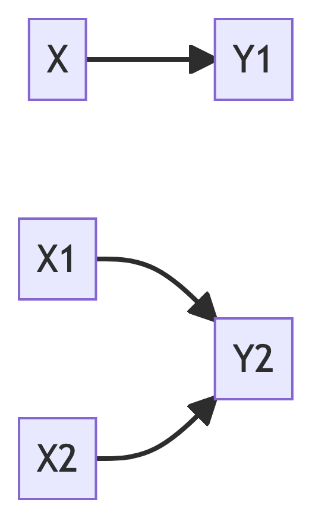

# More lineare models

{width="5%"}

## R-packages needed


## R packages needed for this chapter


::: {.cell hash='regression2_cache/pdf/unnamed-chunk-1_ac19bbc58a49c6e0e5c655aff19db2ff'}

```{.r .cell-code}
library(easystats)
library(tidyverse)
```
:::


## Multiplicative associations

### The Log-Y model

Consider again the linear model, in a simple form:

$$\hat{y} = \beta_0 + \beta_1 x_1 +  \ldots + b_kx_k +$$ Surprisingly, we can use this *linear* model to describe *multiplicative* assocations:

$\hat{y} = e^{b_0 + b_1x_1 + b_2x_2 + \ldots + b_kx_k}$

(I wrote `b` instead of $\beta$ just to show that both has its meaning, but are separate things.)

Exponentiate both sides to get:

$log (\hat{y}) = b_0 + b_1x_1 + b_2x_2 + \ldots + b_kx_k$

For simplicity, let's drop the subscripts in the following without loss of generality and keep it short:

$y = e^{x}$, with $e \approx 2.71...$

Exponentiate both sides to get:

$log(y) = x$

This association is called multiplicative, because if x increases by 1, y increased by a *constant factor*.

::: callout-note
The logarithm is not defined for negative (input) values. And $log(0) = -\infty$.
:::

A side-effect of modelling `log_y` instead of `y` is that the distribution shape of the outcome variable changes. This can be useful at times.


Log-Y Regression can usefully be employed for modelling growth, among othrs, see @exm-logy.

::: {#exm-logy}

## Bacteria growth

Some bacteria dish grows with at a fixed proportional rate, that is it doubles its population size in a fixed period of time. This is what is called exponential growth.
For concreteness, say, the bacteriae double each two days, starting with 1 unit of bacteria.

After about three weeks, we'll have this number (of units) of bacteriae:


::: {.cell hash='regression2_cache/pdf/unnamed-chunk-2_2fdcf163383b0d782716927792a01a32'}

```{.r .cell-code}
e <- 2.7178
e^10
```

::: {.cell-output .cell-output-stdout}
```
[1] 21987.45
```
:::
:::


:::


### Exercise

-   [Effect of education on income](https://datenwerk.netlify.app/post/log-y-regr1/log-y-regr1/)
-   [Effect of log-y transformation on the distribution, an example](https://datenwerk.netlify.app/post/log-y-regr2/log-y-regr2/)

::: callout-note
The exercises are written in German Language. Don't fret. Browsers are able to translate websites instantaneously. Alternatively, go to sites such as [Google Translate](https://translate.google.de/?sl=de&tl=en&op=websites) and enter the URL of the website to be translated. Also check out the webstor of your favorite browser to get an extention [such as this one for Google Chrome](https://chrome.google.com/webstore/detail/google-translate).
:::

### Visualizing Log Transformation

Check out [this post](https://data-se.netlify.app/2022/01/14/visualizing-a-log-y-regression-model/) for an example of a log-y regression visualized.

[This post](https://data-se.netlify.app/2021/06/17/ein-beispiel-zum-nutzen-einer-log-transformation/) puts some more weight to the argument that a log-y transformation is useful (if you want to model multiplicative relations).

### Further reading

Check out [this great essay by Kenneth Benoit](https://kenbenoit.net/assets/courses/ME104/logmodels2.pdf) on different log-variants in regression. Also @gelman_regression_2021, chapter 12 (and others), is useful.

## Interaction

### Multiple predictors, no interaction

Regression analyses can be used with more than one predictor, see Figure @fig-multregr.


:::{.cell}

:::{.cell-output-display}

:::{#fig-multregr}

<p >

{width="6.5in" height="3.5in" fig-pos='H'}

</p>


One predictor (X) vs. two predictors (X1, X2)
:::
:::
:::


 given by Figure @fig-3dregr, where a 3D account of a regression is given. 3D means to input variables, and (which is always the case) one output variable.

::: callout-note
Note that the slope in linear in both axis (X1 and X2).
:::

A different perspective is shown [here](https://upload.wikimedia.org/wikipedia/commons/a/ae/2d_multiple_linear_regression.gif?20161014061355),  
where a 3D account of a regression is given. 3D means to input variables, and (which is always the case) one output variable.

::: callout-important
If the slope for one predictor is the same for all values of the other predictor, then we say that no interaction is taking place.
:::

Here's a visualization of a 3D regression plane (not line) *without interaction*: constant slope in one axis, see the following figure, @fig-3dregr2.


::: {.cell layout-align="center" hash='regression2_cache/pdf/fig-3dregr2_877d0ef0cc02abaa6df0c9aff2e2c946'}
::: {.cell-output-display}
{#fig-3dregr2-1 fig-align='center' width=5.83in}
:::

::: {.cell-output-display}
{#fig-3dregr2-2 fig-align='center' width=5.83in}
:::

::: {.cell-output-display}
{#fig-3dregr2-3 fig-align='center' width=5.83in}
:::
:::


Note that in the above figure, the slope in each predictor axis equals 1, boringly. Hence the according 2D plots are boring, too.

For the sake of an example, consider this linear model:

$mpg \sim hp + disp$

Or, in more regression like terms:

$y = \beta_0 + \beta_1 x_1 + \beta_2 x_2 + \epsilon$, where x1 is `hp` and `x2` is `disp` in the `mtcars` dataset.

In R terms:


::: {.cell hash='regression2_cache/pdf/unnamed-chunk-4_4fdd815d188e2cb0949120d14e4bd0e3'}

```{.r .cell-code}
lm3d <- lm(mpg ~ hp + disp, data = mtcars)
```
:::


The 3D plot is shown in Figure @fig-mtcars3d.


::: {.cell hash='regression2_cache/pdf/fig-mtcars3d_3b01625d819c5d3ff955888c4fa64b94'}
::: {.cell-output-display}
{#fig-mtcars3d}
:::
:::


Here are the two corresponding 2d (1 predictor) regression models:


::: {.cell hash='regression2_cache/pdf/unnamed-chunk-6_ab43447fd895a316d4d78169e6db8787'}

```{.r .cell-code}
lm1 <- lm(mpg ~ hp, data = mtcars)
plot(estimate_relation(lm1))
```

::: {.cell-output-display}
{fig-pos='H'}
:::

```{.r .cell-code}
lm2 <- lm(mpg ~ disp, data = mtcars)
plot(estimate_relation(lm2))
```

::: {.cell-output-display}
{fig-pos='H'}
:::
:::


Checkout [this post](https://data-se.netlify.app/2022/04/19/3d-regression-plane-with-scatter-plot/) for a visually slightly more appealing 3d regression plane.

### Interaction

For interaction to happen we relax the assumption that the slope of predictor 1 must be constant for all values of predictor 2.

In R, we specify an interaction model like this:


::: {.cell hash='regression2_cache/pdf/unnamed-chunk-7_c0c1e9a371c4430a751df4ede09e1070'}

```{.r .cell-code}
lm3d_interact <- lm(mpg ~ hp + disp + hp:disp, data = mtcars)
```
:::


The symbol `hp:disp` can be read as "the interaction effect of `hp` and `disp`".

Here's a visual account, see Figure @fig-mtcars3d-interact.


::: {.cell hash='regression2_cache/pdf/fig-mtcars3d-interact_8fc86060212582dea2db5c5792fa17fb'}
::: {.cell-output-display}
{#fig-mtcars3d-interact}
:::
:::


Compare @fig-mtcars3d-interact and @fig-mtcars3d.

In @fig-mtcars3d-interact you'll see that the lines along the Y axis are not parallel anymore. Similarly, the lines along the X axis are not parallel anymore.

::: callout-important
If the regression lines (indicating different values of one predictor) are *not* parallel, we say that an interaction effect is taking place.
:::

However, the *difference* or *change* between two adjacent values (lines) is constant. This value is the size the regression effect.

### Interaction made simple

If you find that two sophisticated, consider the following simple case.

First, we mutate `am` to be a factor variable, in order to make things simpler (without loss of generality).


::: {.cell hash='regression2_cache/pdf/unnamed-chunk-9_fc64e2a3c299422e0497a4b474ea219b'}

```{.r .cell-code}
mtcars2 <-
  mtcars %>% 
  mutate(am_f = factor(am))
```
:::


Now we use this new variable for a simple regression model:


::: {.cell hash='regression2_cache/pdf/unnamed-chunk-10_8ca4b0daf527bfd5ef8d4e8aff4425c2'}

```{.r .cell-code}
lm_interact_simple <- lm(mpg ~ disp + am_f + disp:am_f, data = mtcars2)
```
:::


Here's the plot, Figure @fig-interact-simple.


::: {.cell hash='regression2_cache/pdf/fig-interact-simple_2afd2560d8e8b1004248403db553e51c'}

```{.r .cell-code}
plot(estimate_relation(lm_interact_simple))
```

::: {.cell-output-display}
{#fig-interact-simple fig-pos='H'}
:::
:::


In this picture, we see that the two regression lines are *not* parallel, and hence there is evidence of an interaction effect.

The interaction effect amounts to the *difference* in slops in Figure @fig-interact-simple.

One might be inclined to interpret Figure @fig-interact-simple as an 3D image, where the one (reddish) line is in the foreground and the blueish line in the background (or vice versa, as you like). Given a 3D image (and hence 2 predictors), we are where we started further above.

For completeness, here are the parameters of the model.


::: {.cell hash='regression2_cache/pdf/unnamed-chunk-12_f8ed49c16001746baebfcdd4e6f4ebdc'}
::: {.cell-output-display}
|Parameter       | Coefficient |       SE |             95% CI | t(28) |      p |
|:---------------|:-----------:|:--------:|:------------------:|:-----:|:------:|
|(Intercept)     |       25.16 |     1.93 |     (21.21, 29.10) | 13.07 | < .001 |
|disp            |       -0.03 | 6.22e-03 |     (-0.04, -0.01) | -4.44 | < .001 |
|am f (1)        |        7.71 |     2.50 |      (2.58, 12.84) |  3.08 | 0.005  |
|disp * am f (1) |       -0.03 |     0.01 | (-0.05, -7.99e-03) | -2.75 | 0.010  |
:::
:::


### Centering variables

The effect of of `am_f` must be interpreted when `disp` is zero, which does not make much sense.

Therefore it simplifies the interpretation of regression coefficients to *center* all input variables, by subtrating the mean value ("demeaning" or "centering"):

$$x' = x - \bar{x}$$ In R, this can be achieved e.g,. in this way:


::: {.cell hash='regression2_cache/pdf/unnamed-chunk-13_df15a2c1fa06191aae44cf5cc1815fa2'}

```{.r .cell-code}
mtcars3 <- 
mtcars2 %>% 
  mutate(disp_c = disp - mean(disp))
```
:::

::: {.cell hash='regression2_cache/pdf/unnamed-chunk-14_c61e537c403dead288b5ebcc3047baf9'}

```{.r .cell-code}
lm_interact_simple2 <- lm(mpg ~ disp_c + am_f + disp_c:am_f, data = mtcars3)
parameters(lm_interact_simple2)
```

::: {.cell-output .cell-output-stdout}
```
Parameter         | Coefficient |       SE |         95% CI | t(28) |      p
----------------------------------------------------------------------------
(Intercept)       |       18.79 |     0.76 | [17.23, 20.36] | 24.63 | < .001
disp c            |       -0.03 | 6.22e-03 | [-0.04, -0.01] | -4.44 | < .001
am f [1]          |        0.45 |     1.39 | [-2.40,  3.30] |  0.32 | 0.748 
disp c * am f [1] |       -0.03 |     0.01 | [-0.05, -0.01] | -2.75 | 0.010 
```
:::
:::


## Predictor relevance

Given a model, we might want to know which predictor has the strongest association with the outcome?

In order to answer this question, all predictor must have the same scale. Otherwise the importance of a predictor would increase by 1000, if we multiply each of the observations' values by the same factor. However, this multiplication should not change the relevance of a predictor.

A simple solution is to standardize all predictors to the same scale (sd=1).


::: {.cell hash='regression2_cache/pdf/unnamed-chunk-15_96b86c836d296220d40f5d6b37adcef2'}

```{.r .cell-code}
mtcars4 <-
  mtcars %>% 
  standardize(select = c("disp", "hp", "cyl"))
```
:::


By the way, "standardizing" centers the variable by default to a mean value of zero (by demeaning).

See:


::: {.cell hash='regression2_cache/pdf/unnamed-chunk-16_749b5769b85df978ed0470e88d6fc38a'}

```{.r .cell-code}
head(mtcars4$disp)
```

::: {.cell-output .cell-output-stdout}
```
[1] -0.57061982 -0.57061982 -0.99018209  0.22009369  1.04308123 -0.04616698
```
:::

```{.r .cell-code}
head(mtcars$disp)
```

::: {.cell-output .cell-output-stdout}
```
[1] 160 160 108 258 360 225
```
:::
:::


Here's the SD:


::: {.cell hash='regression2_cache/pdf/unnamed-chunk-17_c1de1ba13b65803216cc38fc6800d597'}

```{.r .cell-code}
sd(mtcars4$disp)
```

::: {.cell-output .cell-output-stdout}
```
[1] 1
```
:::

```{.r .cell-code}
sd(mtcars$disp)
```

::: {.cell-output .cell-output-stdout}
```
[1] 123.9387
```
:::
:::


And here's the mean value:


::: {.cell hash='regression2_cache/pdf/unnamed-chunk-18_950ff0f7998112066dddd495c021d73b'}

```{.r .cell-code}
mean(mtcars4$disp)
```

::: {.cell-output .cell-output-stdout}
```
[1] -9.084937e-17
```
:::

```{.r .cell-code}
mean(mtcars$disp)
```

::: {.cell-output .cell-output-stdout}
```
[1] 230.7219
```
:::
:::


Now we are in a position to decide which predictor is more important:


::: {.cell hash='regression2_cache/pdf/unnamed-chunk-19_7771e89ebd5201dce869f1029061ad6f'}

```{.r .cell-code}
m <- lm(mpg ~ disp + hp + cyl, data = mtcars4)
parameters(m)
```

::: {.cell-output .cell-output-stdout}
```
Parameter   | Coefficient |   SE |         95% CI | t(28) |      p
------------------------------------------------------------------
(Intercept) |       20.09 | 0.54 | [18.98, 21.20] | 37.20 | < .001
disp        |       -2.33 | 1.29 | [-4.98,  0.31] | -1.81 | 0.081 
hp          |       -1.01 | 1.00 | [-3.06,  1.05] | -1.00 | 0.325 
cyl         |       -2.19 | 1.42 | [-5.11,  0.72] | -1.54 | 0.135 
```
:::
:::


## Exercises

-   [Predictor relevance](https://datenwerk.netlify.app/posts/log-y-regr3/log-y-regr3/)
-   [Adjusting](https://datenwerk.netlify.app/posts/adjustieren1/adjustieren1/)
-   [Adjusting 2](https://datenwerk.netlify.app/posts/adjustieren2/adjustieren2/)
-   [Interpreting Regression coefficients](https://datenwerk.netlify.app/posts/interpret-koeff/interpret-koeff/)

## Lab

Get your own data, and build a simple model reflecting your research hypothesis based on the topics covered in this chapter. If you are lacking data (or hypothesis) get something close to it.

## Glimpse on parameter estimation

An elegant yet simple explanation of the math of parameter estimation can be found [at "go data driven"](https://godatadriven.com/blog/the-linear-algebra-behind-linear-regression/). 
A similar approach is presented [here](https://shainarace.github.io/LinearAlgebra/leastsquares.html).

Consider this geometric interpretation of the least square method in Figure @fig-leastsq.


::: {.cell hash='regression2_cache/pdf/fig-leastsq_45c7ce781f80a6ec6181ae996f27d3ff'}
::: {.cell-output-display}
{#fig-leastsq width=25%}
:::
:::


## Literatur

A recent but already classic book on regression and inference (if this is possible) is the book by @gelman_regression_2021. A great textbook on statistical modelling (with a Bayesian flavor) was written by @mcelreath_statistical_2020; it's suitable for PhD level.

Mathematical foundations can be found in @deisenroth_mathematics_2020. [Here's](https://data-se.netlify.app/2022/06/13/free-resources-for-aspiring-data-adepts/) a collection of online resources tapping into statistics and machine learning.
